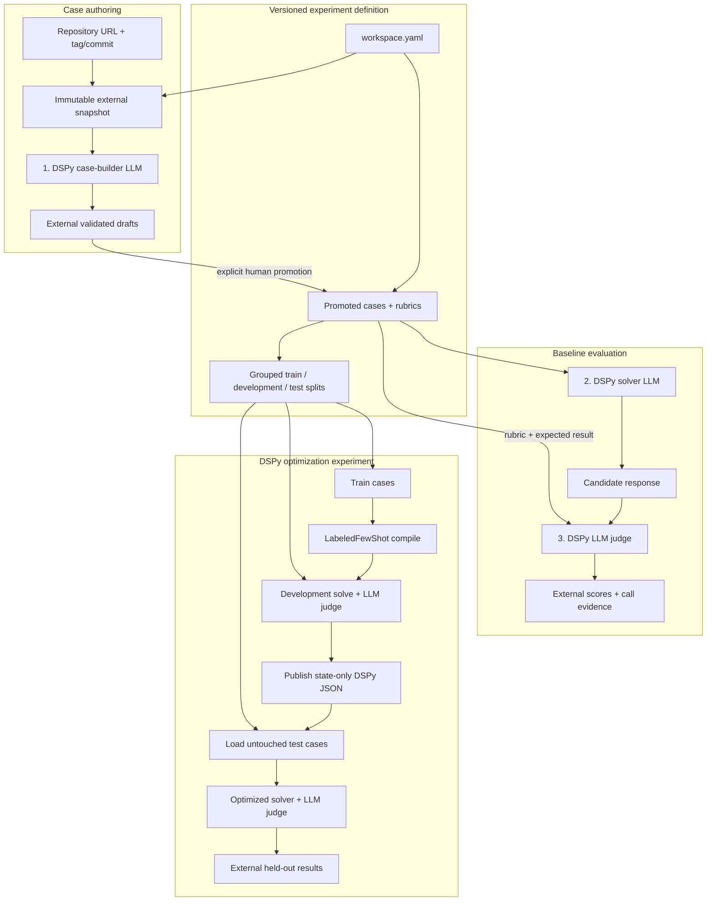

# MS Agent Eval

MS Agent Eval is a Python 3.12+ DSPy evaluation framework for arbitrary source
repositories. A repository URL/ref and its instruction paths are configuration;
the evaluated project is never a dependency of this library.

The framework has no built-in target repository. Each experiment workspace
independently selects its repository, immutable revision, instruction sources,
cases, rubrics, and models.

## Technology at a glance

| Technology | How it is used |
|---|---|
| Python 3.12+ | Framework implementation and `ms-agent-eval` command-line interface. |
| DSPy 3.2 | The only prompt-programming layer. Typed DSPy signatures define the case builder, solver, and judge; `LabeledFewShot` compiles optimized solver state. |
| Ollama | Current local LLM provider for all three roles through DSPy's LM interface. Each role must use a different model identity. |
| YAML / PyYAML | Human-readable workspace configuration, case metadata, rubrics, split assignments, and judge-calibration manifests. |
| Git | Resolves a repository URL plus tag or commit into an immutable source snapshot with recorded provenance. |
| Docker | Optional digest-pinned sandbox for commands that must execute against the target repository. Response-only evaluations do not require a container. |
| SHA-256 + JSON artifacts | Identifies snapshots, programs, inputs, calls, and results so runs are reproducible and auditable. |
| External filesystem storage | Keeps snapshots, drafts, model-call evidence, compiled DSPy programs, runs, and reports under `~/ms_agent_eval/<workspace-id>` instead of committing them. |
| `uv`, Hatchling, pytest, Ruff | Dependency/environment management, package builds, tests, and linting. |

The target repository is data, not a Python dependency of the framework. The
framework snapshots it, loads only the configured instructions and cases, asks
the selected LLMs to build/solve/judge, and writes all mutable evidence outside
both repositories.

## How an experiment runs

Every scored workflow has three distinct LLM roles and a strict data boundary:



- The case builder authors grounded prompts, expected results, rubrics, source
  paths, and leakage groups. It cannot see solver answers or evaluation results.
- The solver sees the task and locked instruction context, never the rubric or
  expected result.
- The LLM judge is the only semantic scorer. Framework code only validates its
  typed result, aggregates votes, and computes weighted arithmetic.

There is no raw prompt engine, deterministic evaluator plugin, legacy reader,
or user-facing engine selector.

## Install

DSPy is a required base dependency:

```bash
uv sync --python 3.12
uv run ms-agent-eval --help
```

## Create a workspace

```bash
uv run ms-agent-eval init \
  --id example-evaluation \
  --repo https://github.com/example/project \
  --ref v1.2.3 \
  --global-instructions AGENTS.md \
  --skills-directory .agents/skills \
  --cases cases
```

The generated `workspace.yaml` has only two user-facing sections:

1. `evaluation`: repository, global instructions, exactly one skill selection,
   case builder, case directory, split policy, and LLM judge.
2. `experiments`: solver, runtime, normal evaluation, and optional DSPy
   optimization.

Use `skills.files` instead of `skills.directory` when evaluating only an exact
list of `SKILL.md` files. Both-or-neither is rejected.

## Configure the three models

Copy `.env.example` to `.env` beside `workspace.yaml`, or export the variables:

```dotenv
OLLAMA_BASE_URL=http://localhost:11434
MS_AGENT_EVAL_CASE_BUILDER_MODEL=builder-model
MS_AGENT_EVAL_SOLVER_MODEL=solver-model
MS_AGENT_EVAL_JUDGE_MODEL=judge-model
```

The resolved provider/model identities must all differ. Runtime state defaults
to `~/ms_agent_eval/<workspace-id>`; `workspace.data_root` may explicitly select
another external path.

## Full flow

```bash
uv run ms-agent-eval validate --workspace workspace.yaml
uv run ms-agent-eval cases build \
  --workspace workspace.yaml \
  --coverage "Create one grounded case for every discovered skill"
uv run ms-agent-eval cases inspect-drafts --workspace workspace.yaml
uv run ms-agent-eval cases promote --workspace workspace.yaml --draft DRAFT_ID
uv run ms-agent-eval inspect --workspace workspace.yaml
uv run ms-agent-eval run baseline --workspace workspace.yaml
uv run ms-agent-eval run optimize-few-shot --workspace workspace.yaml
```

Generated snapshots, builder calls/drafts, solver calls, judge calls, compiled
state, results, and reports remain outside Git. Only `workspace.yaml`, promoted
case packages, split assignments, and human-labelled judge calibration inputs
are versioned.

Start with [Getting started](docs/getting-started.md), then read
[Repository structure](docs/structure.md) and [Conventions](docs/conventions.md).

## Storage layout

There are two locations with different ownership. The Git repository contains
reusable code and reviewable experiment definitions:

```text
repository/
├── .agents/skills/             framework authoring workflows
├── src/ms_agent_eval/          repository-agnostic library and CLI
├── experiments/
│   └── <workspace>/
│       ├── workspace.yaml      target, instructions, cases, models, runtime
│       ├── .env.example        credential-free environment template
│       ├── cases/              promoted cases, rubrics, provenance, splits
│       └── judge-calibration/  human-labelled judge fixtures
├── tests/                      generic framework acceptance tests
└── docs/                       guides and architecture records
```

Mutable and generated data belongs outside Git under the workspace data root:

```text
~/ms_agent_eval/<workspace-id>/
├── snapshots/                  immutable target-repository snapshots
├── case-drafts/                builder drafts awaiting explicit promotion
├── blobs/sha256/               content-addressed responses, traces, and state
├── manifests/                  locks, model calls, runs, scores, and reports
└── tmp/                        atomic staging
```

There is no root-level `cases/`, `sdk/`, or `runs/` directory. Cases belong to
their experiment workspace; repository snapshots and every generated run
artifact belong to the external data root. Adding a target means adding a new
workspace, not changing `src/ms_agent_eval` or copying an SDK into this repo.

## Verify

```bash
uv run ruff check src tests
uv run pytest
uv lock --check
uv build
```
