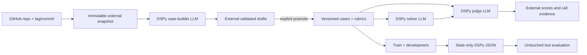

# MS Agent Eval

MS Agent Eval is a Python 3.12+ DSPy evaluation framework for arbitrary GitHub
repositories. A repository URL/ref and its instruction paths are configuration;
the evaluated project is never a dependency of this library.

Every scored workflow has three distinct LLM roles:



- The case builder authors grounded prompts, expected results, rubrics, source
  paths, and leakage groups. It cannot see solver answers or evaluation results.
- The solver sees the task and locked instruction context, never the rubric or
  expected result.
- The LLM judge is the only semantic scorer. Framework code only validates its
  typed result, aggregates votes, and computes weighted arithmetic.

There is no raw prompt engine, deterministic evaluator plugin, legacy reader,
or user-facing engine selector.

## Install

DSPy is a required base dependency:

```bash
uv sync --python 3.12
uv run ms-agent-eval --help
```

## Create a workspace

```bash
uv run ms-agent-eval init \
  --id example-evaluation \
  --repo https://github.com/example/project \
  --ref v1.2.3 \
  --global-instructions AGENTS.md \
  --skills-directory .agents/skills \
  --cases cases
```

The generated `workspace.yaml` has only two user-facing sections:

1. `evaluation`: repository, global instructions, exactly one skill selection,
   case builder, case directory, split policy, and LLM judge.
2. `experiments`: solver, runtime, normal evaluation, and optional DSPy
   optimization.

Use `skills.files` instead of `skills.directory` when evaluating only an exact
list of `SKILL.md` files. Both-or-neither is rejected.

## Configure the three models

Copy `.env.example` to `.env` beside `workspace.yaml`, or export the variables:

```dotenv
OLLAMA_BASE_URL=http://localhost:11434
MS_AGENT_EVAL_CASE_BUILDER_MODEL=builder-model
MS_AGENT_EVAL_SOLVER_MODEL=solver-model
MS_AGENT_EVAL_JUDGE_MODEL=judge-model
```

The resolved provider/model identities must all differ. Runtime state defaults
to `~/ms_agent_eval/<workspace-id>`; `workspace.data_root` may explicitly select
another external path.

## Full flow

```bash
uv run ms-agent-eval validate --workspace workspace.yaml
uv run ms-agent-eval cases build \
  --workspace workspace.yaml \
  --coverage "Create one grounded case for every discovered skill"
uv run ms-agent-eval cases inspect-drafts --workspace workspace.yaml
uv run ms-agent-eval cases promote --workspace workspace.yaml --draft DRAFT_ID
uv run ms-agent-eval inspect --workspace workspace.yaml
uv run ms-agent-eval run baseline --workspace workspace.yaml
uv run ms-agent-eval run optimize-few-shot --workspace workspace.yaml
```

Generated snapshots, builder calls/drafts, solver calls, judge calls, compiled
state, results, and reports remain outside Git. Only `workspace.yaml`, promoted
case packages, split assignments, and human-labelled judge calibration inputs
are versioned.

Start with [Getting started](docs/getting-started.md), then read
[Repository structure](docs/structure.md) and [Conventions](docs/conventions.md).

## Repository layout

```text
.agents/skills/              repository-local authoring workflows
src/ms_agent_eval/           one installable library
experiments/mainsequence-sdk one example workspace
tests/                       synthetic three-LLM acceptance tests
docs/                        current guides and historical task records
```

## Verify

```bash
uv run ruff check src tests
uv run pytest
uv lock --check
uv build
```
