# 000 — Refactor Analysis for a Library-Agnostic Agent Evaluation Framework

Status: Accepted architecture baseline — phases 0–8 implemented on 2026-08-19
Priority: P0 / foundational
Scope: framework monorepo, DSPy program/optimization model, experiment model, GitHub sources, Docker execution, external result storage, and migration
Current target used as migration proof: `mainsequence-sdk` at tag `v4.4.5`

> Historical analysis: package-oriented sketches and legacy paths below record
> the pre-refactor state. The implemented layout is defined by tasks 014–016
> and `docs/structure.md`: one generic `src/ms_agent_eval/` library plus
> experiment-owned suites, evaluators, runtimes, sources, and plans.

## Executive Decision

The project should stop modeling itself as “the Main Sequence SDK training repository” and instead model itself as an evaluation framework that can evaluate instruction bundles from any configured GitHub repository at an immutable revision.

Main Sequence must become one configured evaluation target:

```yaml
id: mainsequence-sdk
source:
  type: github
  repository_url: https://github.com/mainsequence-sdk/mainsequence-sdk
  ref:
    type: tag
    value: v4.4.5
```

The framework must resolve that tag to an exact commit, create an immutable snapshot of the configured instruction material, and run a separately versioned evaluation suite against that snapshot.

The framework itself must not:

- depend on `mainsequence`;
- import `agent_scaffold`;
- assume that the evaluated project is a Python distribution;
- use an installed package version as target identity;
- assume files are named `AGENTS.md` or `SKILL.md`;
- assume an instruction hierarchy called `skills`;
- put target-specific evaluator logic in the framework core;
- assume Ollama is the only model provider;
- use `sdk_version`, `skill_path`, or `runs/sdk` as core domain concepts.

The correct core concepts are:

- **target**: a user-configured repository to evaluate;
- **source revision**: a requested tag or commit and its resolved immutable commit SHA;
- **snapshot**: the exact instruction content extracted from that revision;
- **instruction bundle**: a configured collection of global and unit-specific prompt context;
- **instruction unit**: one addressable prompt/instruction component within a bundle;
- **suite**: a versioned collection of cases and rubrics;
- **compatibility mapping**: the explicit mapping between a target snapshot and suite versions;
- **experiment**: a version-controlled matrix selecting targets, suites, runtimes, prompts, models, evaluators, repetitions, and storage;
- **runtime profile**: the isolated environment recipe used to install/import/execute a target;
- **execution backend**: the mechanism that runs untrusted repository work, with Docker as the default;
- **program specification**: a versioned, provider-neutral declaration of model inputs, typed outputs, execution strategy, and explicitly tunable surfaces;
- **program engine**: the implementation that turns a program specification into model calls, with DSPy as the canonical authored-program engine;
- **raw-message program**: a frozen message renderer retained for legacy replay, prompt-parity checks, and unbiased controls;
- **compiled program artifact**: immutable optimizer output bound to the base program, DSPy version, metric, data split, optimizer, and model identities;
- **model provider**: configured model access consumed through an engine-specific binding while producing framework-standard call records;
- **evaluator**: a registered implementation that judges a response;
- **optimization run**: a separate experiment that compiles a program against an approved metric and training/development split;
- **run**: an immutable record combining all of the above;
- **result store**: an external artifact and metadata data plane for snapshots, runs, evaluations, and reports.

The legacy evaluator-trustworthiness draft, now task 010, should not be implemented in its current form. Its goal remains correct, but its package names, paths, runner assumptions, DSPy metric boundary, and placement of Main Sequence-specific evaluation code must be revised after the foundational tasks.

## Goal

A user should be able to configure a new target without modifying framework source code.

Minimum user workflow:

```bash
agent-eval target add \
  --id mainsequence-sdk \
  --github-url https://github.com/mainsequence-sdk/mainsequence-sdk \
  --tag v4.4.5 \
  --config experiments/mainsequence-sdk/targets/mainsequence-sdk.yaml

agent-eval target snapshot --target mainsequence-sdk
agent-eval suite validate --suite mainsequence-agent-skills --snapshot <COMMIT_SHA>
agent-eval run --suite mainsequence-agent-skills --snapshot <COMMIT_SHA> --case or-001
```

The same framework should support another repository through data and trusted evaluator plugins only:

```bash
agent-eval target add \
  --id another-agent-library \
  --github-url https://github.com/example/another-agent-library \
  --commit 0123456789abcdef0123456789abcdef01234567
```

No framework Python constant should need to change.

## Correct System Boundary: Framework, Experiments, Execution, and Results

The system is not only a reusable library and not only a corpus. It has four distinct responsibilities that must be configured and deployed independently.

### 1. Framework control plane

The framework control plane is trusted, installable machinery. It owns:

- configuration parsing and validation;
- GitHub source resolution;
- experiment planning and matrix expansion;
- Docker environment preparation;
- model-provider orchestration;
- evaluator orchestration;
- run-state transitions;
- artifact and metadata storage interfaces;
- reporting and comparison logic.

It must not contain one evaluated repository as a dependency or default.

### 2. Version-controlled experiment definitions

An experiment definition is analogous to a test suite in `pytest`. It declares what should be tested, but it is not a test result.

Version-controlled experiment material includes:

- target configurations;
- suite cases, prompts, rubrics, and expected artifacts;
- compatibility mappings;
- program specifications and raw-message control profiles;
- dataset split manifests and optimizer profiles;
- runtime profiles;
- model-provider profile references without secrets;
- evaluator plugin references;
- experiment matrix definitions;
- calibration fixtures;
- documentation explaining the experiment.

This material may live in the framework monorepo for first-party experiment packs, or in a separate experiment repository that depends on the framework package.

### 3. Isolated execution plane

Target repositories are untrusted and may need to be installed, imported, tested, or modified by an agent. They must run in disposable execution environments, with Docker as the first required backend.

The execution plane owns:

- exact target checkout at the resolved commit;
- target dependency installation;
- Python import and command execution;
- agent tool execution;
- test execution;
- collection of response text, patches, command logs, test output, and artifacts;
- resource and network isolation.

The host framework process must never import or execute target repository code directly.

### 4. External results data plane

Snapshots, raw prompts, model responses, logs, patches, evaluator records, reports, and container evidence are experiment data. They are not source code and should not be committed to the framework or experiment Git repositories.

The results data plane owns:

- source checkout caches;
- extracted snapshots;
- Docker build caches and environment descriptors;
- run manifests;
- raw model requests/responses;
- agent transcripts;
- generated files and patches;
- command/test evidence;
- evaluations;
- aggregate reports;
- retention and redaction state.

For local use, this can be a configured filesystem root. For shared use, it should support object storage plus a metadata database.

### Recommended deployment topology

```mermaid
flowchart LR
    A["Framework monorepo or installed package"] --> B["Experiment definition"]
    B --> C["Experiment planner"]
    C --> D["GitHub source resolver"]
    D --> E["External snapshot store"]
    C --> F["Docker executor"]
    E --> F
    F --> G["Disposable target container"]
    G --> H["Controlled output export"]
    H --> I["Trusted evaluator worker"]
    I --> J["External result store"]
    J --> K["Reports and comparisons"]
```



### Important clarification about a monorepo

A monorepo is appropriate for the trusted framework packages, first-party executor/provider plugins, target-specific evaluator extensions, and version-controlled experiment packs.

Raw results should not be Git-tracked inside that monorepo. The repository may expose a conventional local mount point such as `var/`, but it must be ignored and configurable:

```text
monorepo/var -> ${MS_AGENT_EVAL_DATA_ROOT}
```

If curated results need to be published through Git, use an optional results-catalog repository containing small immutable manifests, signed summaries, and external artifact URIs. Do not put raw transcripts, model payloads, cloned repositories, container filesystems, or large artifacts in that catalog.

## Experiment as a First-Class Object

The previous design described targets, suites, and runs but missed the object that binds them together. That object is an **experiment**.

An experiment selects:

- one or many target repositories and revisions;
- one or many suites/case filters;
- runtime/environment profiles;
- base or compiled program variants;
- model providers and models;
- evaluator profiles;
- repetitions and seeds;
- concurrency and budget limits;
- result storage profile;
- failure and resume policy.

Example `experiments/mainsequence-4-4-5-model-comparison/experiment.yaml`:

```yaml
schema_version: 1
id: mainsequence-4-4-5-model-comparison
description: Compare two models on the Main Sequence agent-scaffold v2 suite.

targets:
  - target_id: mainsequence-sdk
    ref:
      type: tag
      value: v4.4.5
    runtime_profile: python-uv-3.12

suites:
  - suite_id: mainsequence-agent-skills
    version: v2
    cases:
      include:
        - "*"

programs:
  - id: target-instructions-dspy
    specification: instruction-response-v1
    compiled_artifact: null
  - id: target-instructions-raw-control
    specification: legacy-skill-evaluation-v1

context_variants:
  - id: with-target-unit
    include_instruction_unit: true
  - id: without-target-unit
    include_instruction_unit: false

models:
  - provider_profile: local-ollama
    model: ms-fast:latest
  - provider_profile: local-ollama
    model: ms-reasoning:latest

execution:
  backend: docker
  repetitions: 3
  concurrency: 2
  fail_fast: false
  resume: true

storage_profile: local-experiment-data
```

For ten Python repositories, `targets` contains ten entries or references a reusable target group. Each target may select a different runtime profile while the experiment planner expands the target × suite × program × context variant × model × repetition matrix into immutable run jobs.

The experiment definition is committed. Each execution of it receives a unique `experiment_run_id` and writes all runtime records externally.

## Current Coupling Inventory

The current coupling is structural, not cosmetic.

### Packaging coupling

`pyproject.toml` currently:

- names the project `sdk-agent-training`;
- describes it as a Main Sequence corpus;
- installs `mainsequence==4.4.5` as a runtime dependency;
- does not expose an importable framework package or CLI entry point.

Impact:

- the framework cannot be installed independently;
- selecting another target requires changing dependencies and rebuilding the environment;
- the installed package, rather than configuration, determines the target revision.

### Source acquisition coupling

`scripts/populate_training_skills.py` hardcodes:

```python
PACKAGE_NAME = "mainsequence"
BUNDLE_PACKAGE = "agent_scaffold"
```

It then:

- reads a Python distribution version;
- imports a Python package;
- searches for `SKILL.md`;
- assumes global instructions are `AGENTS.md`;
- writes to `sdk/<installed-version>`;
- derives GitHub metadata indirectly from package metadata.

Impact:

- non-Python repositories cannot be evaluated;
- source code at a tag cannot be evaluated without building/installing the package;
- packaging transformations can differ from repository source without being detected;
- repository URL and revision are not first-class user inputs.

### Snapshot coupling

The snapshot schema uses:

- `sdk_package`;
- `sdk_version`;
- `bundle_package`;
- `installed_bundle_package`;
- absolute paths into `.venv`;
- `agent_scaffold/AGENTS.md`;
- `skills/<skill-path>/source/SKILL.md`.

Impact:

- manifests are machine-specific;
- snapshot identity is a package version instead of a content/revision identity;
- different instruction layouts cannot be represented;
- two repositories with the same version string would collide conceptually.

### Case coupling

Case metadata uses:

- `skill_path`;
- `case_set_version` without a suite namespace;
- `authored_against_sdk_version`;
- `target_sdk_version`;
- paths such as `sdk/4.4.5/skills/.../SKILL.md`.

Impact:

- case-set ids can collide across targets;
- one case cannot clearly target multiple instruction units;
- cases are bound to an SDK vocabulary even when the target is not an SDK;
- compatibility is partly duplicated across cases, skill metadata, manifests, and maps.

### Resolution coupling

`scripts/run_ollama_case.py`:

- reads the installed `mainsequence` version;
- locates `sdk/<version>`;
- loads `agent_scaffold/AGENTS.md`;
- loads `skills/<skill-path>/source/SKILL.md`;
- labels the model system prompt as a “Main Sequence skill” evaluation;
- searches all mapped case-set versions rather than resolving one exact suite/unit mapping.

Impact:

- there is no explicit target selection;
- version-specific evaluation depends on the local environment;
- prompt construction is not configurable;
- mixed suite mappings can become ambiguous.

### Run coupling

Runs are stored under:

```text
runs/sdk/<sdk-version>/<agent>/<model>/<timestamp>/
```

Run manifests use a top-level `sdk` object and derive identity from package version, agent label, model label, and second-resolution timestamp.

Impact:

- runs are not namespaced by target or suite;
- a Git commit cannot be the primary revision key;
- replay cannot prove which exact instruction bytes were used;
- multiple targets and multiple suites cannot coexist safely.

### Model-provider coupling

The executable runner is Ollama-specific and includes:

- an Ollama base URL;
- Ollama request/response shapes;
- provider-specific log filenames;
- provider logic mixed with case resolution and evaluation.

Impact:

- adding OpenAI, Codex, or another provider requires duplicating the runner;
- provider configuration is confused with target configuration;
- provider failures can leave partial runs.

### Evaluator coupling

`scripts/evaluate_case.py` contains Main Sequence concepts and commands directly:

- DataNode and SimpleTable AST analyzers;
- orchestration CLI substrings;
- hardcoded Main Sequence case ids and prefixes;
- target-specific quality weights.

Impact:

- the framework package would still be Main Sequence-specific even after making the source URL configurable;
- evaluator releases cannot be versioned independently;
- another target cannot provide its own evaluator without editing the core script.

### Documentation and generator coupling

The README, structure docs, conventions, evaluation specifications, case generator, and local skills all describe Main Sequence as the only possible subject.

Some of these documents should become framework documentation. Others are valid Main Sequence suite material and should move under that suite's namespace.

### Execution-environment gap

The current runner performs response-only model calls and has no abstraction for:

- cloning and installing a target repository;
- selecting Python/runtime versions;
- importing the evaluated library;
- allowing an agent to inspect or modify the target;
- running target commands or tests;
- applying CPU, memory, process, timeout, filesystem, and network limits;
- separating untrusted target code from trusted evaluator code.

Impact:

- the framework cannot evaluate whether generated code actually imports or executes;
- adding repository tools directly would risk running arbitrary target code on the host;
- ten Python repositories would contaminate one shared virtual environment;
- environment differences could be mistaken for model differences.

### Result-storage coupling

The current repository stores snapshots and a historical run inside Git paths and treats a repository-relative run folder as the persistence model.

There is no abstraction for:

- an external data root;
- object storage;
- a queryable run metadata database;
- content-addressed blobs;
- result retention and garbage collection;
- redaction;
- resumable experiment jobs;
- curated result publication separate from raw run storage.

Impact:

- model payloads and logs can be committed accidentally;
- the Git repository grows with every experiment;
- large artifacts and container evidence have no appropriate home;
- multiple machines cannot coordinate experiment state safely;
- result lifetime is confused with source-code history.

## Old-to-New Vocabulary

| Current term | New core term | Notes |
|---|---|---|
| SDK | target | The subject may be an SDK, CLI, agent package, prompt collection, or any repository. |
| SDK version | source revision / snapshot | Tags are resolved to immutable commits. |
| installed package | source adapter input | GitHub is the first required adapter; installed-package support may remain optional. |
| agent scaffold | instruction bundle | Bundle id and layout come from target configuration. |
| skill | instruction unit | A unit can be a skill, role, agent, prompt, policy, or other scoped context. |
| skill path | unit id | Stable logical id, independent of local snapshot path. |
| case set | suite version | Suite ids provide a namespace across targets. |
| case map | compatibility mapping | Stored outside immutable source snapshots. |
| SDK source of truth | source lock | Contains repository, requested ref, resolved commit, and content hashes. |
| run agent | execution provider/profile | Distinguish model provider from evaluated instruction agent. |
| `runs/sdk/...` | external experiment/run namespace | Namespaced by experiment, suite, snapshot, environment, provider, and model. |

## Architectural Principles

### 1. Target configuration is authored; source locks are generated

The user authors:

- repository URL;
- a tag or commit;
- exact global-context paths and instruction-unit source roots/explicit entries;
- selector, logical-id, collision, and inventory assertions for every directory source;
- named context extraction rules;
- suite compatibility declarations.

The framework generates:

- resolved commit SHA;
- fetch timestamp;
- repository canonical URL;
- extracted file inventory;
- exact unit-id-to-source-path inventory and inventory hash;
- content hashes;
- snapshot id;
- tool version used to create the snapshot.

Never mix user intent and generated resolution data in one mutable file.

### 2. Tags are accepted; runs use commits

A tag is a convenient user input, not an immutable run identity by itself.

For every tag:

1. resolve it to an exact commit;
2. correctly dereference annotated tags;
3. record both requested tag and resolved commit;
4. key the snapshot and run by commit or snapshot hash;
5. detect and reject tag movement against an existing lock unless the user explicitly creates a new lock.

Commit inputs must be full 40-character SHAs in persisted locks. Short SHAs may be accepted interactively only after unambiguous resolution.

### 3. Source repositories provide data, not trusted code

Fetching an arbitrary GitHub repository must not automatically:

- install its dependencies;
- import its Python modules;
- execute its scripts;
- run Git hooks;
- initialize submodules;
- download Git LFS objects;
- load evaluator Python from the fetched repository.

Instruction files are treated as untrusted text inputs. Evaluator plugins are trusted framework extensions installed or enabled separately.

### 4. Snapshots are immutable and content-addressed

Once created, a snapshot directory must not be refreshed in place.

If extraction configuration changes for the same commit, create a distinct snapshot id based on:

```text
repository canonical URL
+ resolved commit SHA
+ normalized extraction configuration
+ extracted content hashes
```

This prevents the same commit from silently producing different evaluated prompts.

### 5. Suites are independent of target snapshots

Cases and rubrics evolve on their own version axis. A compatibility mapping explicitly says which suite version applies to which instruction unit for a target snapshot.

The mapping is authored evaluation configuration. It does not belong inside the immutable source snapshot.

### 6. Framework core and domain extensions are separate

Core owns:

- schemas;
- source adapters;
- snapshot creation;
- program-engine protocols and neutral execution records;
- resolution;
- run lifecycle;
- model-provider interfaces;
- evaluator interfaces and result invariants;
- generic reports.

Target/suite extensions own:

- cases and rubrics;
- domain evaluation specifications;
- target-specific rule evaluators;
- case generators;
- reference-source planning documents.

## Proposed Repository Layout

```text
agent-eval-monorepo/
├── pyproject.toml
├── packages/
│   ├── agent-eval-core/
│   │   └── src/agent_eval/
│   │       ├── config/
│   │       ├── experiments/
│   │       ├── sources/
│   │       ├── snapshots/
│   │       ├── suites/
│   │       ├── programs/
│   │       ├── execution/
│   │       ├── providers/
│   │       ├── evaluation/
│   │       ├── optimization/
│   │       ├── storage/
│   │       └── reporting/
│   ├── agent-eval-cli/
│   ├── agent-eval-worker/
│   ├── agent-eval-executor-docker/
│   ├── agent-eval-program-dspy/
│   ├── agent-eval-program-raw/
│   └── agent-eval-provider-ollama/
├── experiments/
│   └── mainsequence-agent-skills/
│       ├── pack.yaml
│       ├── targets/
│       │   └── mainsequence-sdk.yaml
│       ├── suites/
│       │   ├── suite.yaml
│       │   ├── compatibility/
│       │   ├── v1/
│       │   └── v2/
│       ├── runtime-profiles/
│       ├── programs/
│       ├── prompt-profiles/       # legacy/raw-message controls only
│       ├── optimizer-profiles/
│       ├── experiments/
│       └── extensions/
│           └── evaluators/
├── runtime-profiles/
│   ├── python-uv-3.12.yaml
│   └── python-uv-3.12.yaml
├── provider-profiles/
│   └── ollama.example.yaml
├── optimizer-profiles/
│   ├── bootstrap-few-shot.example.yaml
│   └── gepa.example.yaml
├── storage-profiles/
│   └── local.example.yaml
├── docker/
│   ├── worker/Dockerfile
│   └── evaluator/Dockerfile
├── tests/
├── docs/
└── var/                         # ignored mount point; never committed
```

External data layout for a local filesystem profile:

```text
${MS_AGENT_EVAL_DATA_ROOT}/
├── sources/                     # Git checkout cache
├── snapshots/                   # immutable extracted target inputs
├── environments/                # environment manifests and build metadata
├── experiments/
│   └── <experiment-run-id>/
│       ├── experiment.lock.yaml
│       ├── jobs/
│       ├── runs/
│       ├── evaluations/
│       ├── optimizations/
│       └── reports/
├── blobs/                       # content-addressed large artifacts
├── metadata/
│   └── agent-eval.sqlite
└── tmp/
```

Working name: `agent-eval`. The final distribution and import name should be confirmed before the package is published, but implementation must use a neutral name rather than `sdk_agent_training`.

The core package must remain installable alone. The monorepo is an engineering and first-party experiment organization choice, not a requirement that third-party users keep their experiment definitions in the same repository.

## Target Configuration

Each evaluated repository has one target configuration.

Example `experiments/mainsequence-sdk/targets/mainsequence-sdk.yaml`:

```yaml
schema_version: 1
id: mainsequence-sdk
display_name: Main Sequence SDK

source:
  type: github
  repository_url: https://github.com/mainsequence-sdk/mainsequence-sdk
  ref:
    type: tag
    value: v4.4.5
  fetch:
    submodules: false
    git_lfs: false

instruction_bundles:
  - id: agent-scaffold
    display_name: Main Sequence Agent Scaffold

    global_context:
      - id: project-instructions
        source_path: agent_scaffold/AGENTS.md
        required: true

    units:
      sources:
        - id: agent-scaffold-skills
          type: directory
          root: agent_scaffold/skills
          locator:
            filename: SKILL.md
            recursive: true
            include:
              - "**/SKILL.md"
            exclude: []
            follow_symlinks: false
          logical_id:
            strategy: relative-parent
            prefix: ""
          metadata:
            strategy: yaml-frontmatter
            name_field: name
            description_field: description
          assertions:
            exact_count: 20
            required_ids:
              - data_publishing/data_nodes
              - platform_operations/orchestration_and_releases
```

Important properties:

- every `source_path` and unit-source `root` is an explicit path relative to the locked repository root;
- global context is an ordered list of exact files, not one hardcoded filename or a path relative to an ambiguous bundle directory;
- unit roots, file names, glob patterns, and traversal behavior are configurable;
- unit ids are logical ids derived through an explicit strategy.
- frontmatter is optional and configurable.
- program selection belongs to the suite/experiment, not the target configuration.

For the proof target, this path has been verified against Git tag `v4.4.5` / commit `3b5a20a344cec0c960351dc3c601d32a66a8b46e`: the upstream skills are `agent_scaffold/skills/<skill-id>/SKILL.md`. The current repository snapshot stores normalized copies at `sdk/4.4.5/skills/<skill-id>/source/SKILL.md`. Those are different namespaces and both must be recorded; a normalized snapshot path must never be mistaken for the upstream source path.

## Exact Instruction-Unit and Skill Locators

The framework core calls these artifacts **instruction units**. A target may call them skills, agents, roles, policies, or prompts. The target configuration must identify their location exactly; the framework must never search the entire repository for `SKILL.md` and guess which collection is intended.

### Hidden and alternative skill roots

A repository whose skills live under `.agents/skills` configures that root explicitly:

```yaml
instruction_bundles:
  - id: project-agent-skills
    display_name: Project-local agent skills

    global_context:
      - id: repository-agents
        source_path: AGENTS.md
        required: false

    units:
      sources:
        - id: dot-agents-skills
          type: directory
          root: .agents/skills
          locator:
            filename: SKILL.md
            recursive: true
            include:
              - "**/SKILL.md"
            exclude: []
            follow_symlinks: false
          logical_id:
            strategy: relative-parent
            prefix: ""
```

Hidden directories are neither automatically included nor automatically ignored. `.agents/skills` is read only because the target configuration names it. Conversely, a repository that happens to contain `.agents/skills` does not expose those files to an evaluation unless that root is configured.

Other valid examples include:

```yaml
root: agent_scaffold/skills
root: .agents/skills
root: .claude/skills
root: prompts/roles
root: packages/example_agent/skills
```

These are examples, not framework defaults.

### Multiple skill roots

A bundle may intentionally combine several roots, but each source needs a stable id and normally an id prefix:

```yaml
units:
  sources:
    - id: repository-skills
      type: directory
      root: .agents/skills
      locator:
        filename: SKILL.md
        recursive: true
        include: ["**/SKILL.md"]
        exclude: []
        follow_symlinks: false
      logical_id:
        strategy: relative-parent
        prefix: project/

    - id: packaged-skills
      type: directory
      root: src/example_agent/skills
      locator:
        filename: SKILL.md
        recursive: true
        include: ["**/SKILL.md"]
        exclude: []
        follow_symlinks: false
      logical_id:
        strategy: relative-parent
        prefix: package/
```

Duplicate logical ids, duplicate source files, overlapping roots that select the same file, and ids that normalize to the same value are hard validation errors. The framework must not resolve collisions using source order.

### Explicit single-skill selection

For benchmarks that intentionally evaluate only a fixed list, prefer explicit entries:

```yaml
units:
  sources:
    - id: selected-skills
      type: explicit
      entries:
        - id: data_publishing/data_nodes
          source_path: agent_scaffold/skills/data_publishing/data_nodes/SKILL.md
        - id: platform_operations/orchestration_and_releases
          source_path: agent_scaffold/skills/platform_operations/orchestration_and_releases/SKILL.md
```

Directory selection is a configuration convenience, not a runtime lookup strategy. Snapshot creation expands it once into an exact inventory. Every later suite resolution and run uses the locked inventory and never repeats the glob against a mutable checkout.

### Locator rules

All locator implementations must enforce the following:

1. paths are normalized repository-relative POSIX paths;
2. absolute paths, `..` traversal, NUL bytes, and platform-dependent drive paths are rejected;
3. a configured root must exist at the resolved commit and have the expected file/directory type;
4. matching is scoped beneath that root only;
5. symlinks are rejected by default and may never escape the checkout;
6. hidden directories are considered only when they are inside an explicitly configured root and match the configured selector;
7. the configured filename is not implicitly `SKILL.md`—another target may use a different filename or explicit paths;
8. zero matches fail unless the source explicitly declares `allow_empty: true`;
9. expected counts and required ids are checked before snapshot publication;
10. every selected file maps to exactly one stable logical unit id;
11. logical ids are data identifiers, not trusted filesystem paths;
12. no fallback probes such as `.agents/skills`, `skills`, or `agent_scaffold/skills` are attempted.

### Exact run-time resolution

A case identifies the intended instruction content by:

```text
(target_id, snapshot_id, bundle_id, unit_id)
```

That key must resolve to exactly one locked unit record containing the unit-source id, upstream source path, snapshot path, and content hash. Cases and programs must not provide arbitrary paths. If the configured root moves between target commits, a new snapshot and compatibility mapping are required; the resolver must not silently find a similarly named skill elsewhere.

### Commit-based configuration

```yaml
source:
  type: github
  repository_url: https://github.com/example/project
  ref:
    type: commit
    value: 0123456789abcdef0123456789abcdef01234567
```

For reproducibility, the initial implementation should support only `tag` and `commit`. Branch support should be deferred or treated as a convenience that always creates a commit lock and prominently records that the requested ref was floating.

## Generated Source Lock

Example `snapshot.lock.yaml`:

```yaml
schema_version: 1
target_id: mainsequence-sdk
snapshot_id: sha256:...

source:
  type: github
  repository_url_requested: https://github.com/mainsequence-sdk/mainsequence-sdk
  repository_url_canonical: https://github.com/mainsequence-sdk/mainsequence-sdk.git
  ref_requested:
    type: tag
    value: v4.4.5
  ref_resolved: refs/tags/v4.4.5
  commit: 3b5a20a344cec0c960351dc3c601d32a66a8b46e
  resolved_at: 2026-08-19T00:00:00Z

extraction:
  configuration_hash: sha256:...
  bundles:
    agent-scaffold:
      bundle_inventory_hash: sha256:...
      global_context:
        - id: project-instructions
          source_path: agent_scaffold/AGENTS.md
          snapshot_path: content/agent-scaffold/global/project-instructions.md
          sha256: ...
      unit_sources:
        - id: agent-scaffold-skills
          type: directory
          root: agent_scaffold/skills
          locator_hash: sha256:...
          matched_count: 20
          inventory_hash: sha256:...
      units:
        - id: data_publishing/data_nodes
          unit_source_id: agent-scaffold-skills
          source_path: agent_scaffold/skills/data_publishing/data_nodes/SKILL.md
          source_relative_path: data_publishing/data_nodes/SKILL.md
          snapshot_path: content/agent-scaffold/units/data_publishing/data_nodes/instructions.md
          sha256: ...

generator:
  name: agent-eval
  version: 0.2.0
```

Do not store:

- absolute checkout paths;
- virtual-environment paths;
- plaintext credentials;
- an unresolved package version as the revision identity.

The lock is the authoritative exact skill inventory. `configuration_hash` covers ordered global-context locators, every unit-source root/selector/id rule/assertion, and explicit entries. `inventory_hash` covers the ordered `(unit_id, unit_source_id, source_path, sha256)` records. A run manifest copies the selected unit record or references it by content id; it never records only a free-form `skill_path`.

## GitHub Source Adapter

Define a source-provider protocol even if GitHub is the only initial implementation.

```python
class SourceProvider(Protocol):
    def resolve(self, source: SourceConfig) -> ResolvedSource: ...
    def materialize(self, resolved: ResolvedSource, destination: Path) -> None: ...
```

The GitHub adapter must:

1. validate and normalize the repository URL;
2. support public HTTPS GitHub URLs initially;
3. support tag and full-commit refs;
4. resolve annotated and lightweight tags correctly;
5. reject ambiguous or missing refs;
6. use a temporary checkout/cache location;
7. disable Git hooks, submodules, and LFS by default;
8. never execute repository code;
9. validate configured paths stay inside the checkout;
10. reject symlinks that escape the checkout;
11. copy only configured evaluation inputs into the committed snapshot;
12. compute hashes before atomically publishing the snapshot;
13. reuse an identical existing snapshot without rewriting it;
14. detect a moved tag when a lock already exists.

### Authentication

Private GitHub repository support may be added through an environment variable or credential helper, but credentials must never be serialized into target config, source locks, command output, or run logs.

Recommended configuration:

```yaml
authentication:
  strategy: environment
  token_environment_variable: GITHUB_TOKEN
```

The persisted lock should record only that authenticated access was used, not the secret value.

### Network-independent tests

Unit tests must not depend on GitHub availability. Create a temporary local Git repository with:

- a lightweight tag;
- an annotated tag;
- two commits;
- an instruction bundle fixture;
- a path traversal/symlink fixture.

Mock only URL transport/normalization where necessary. Test the actual ref resolution and extraction logic against the local repository.

An optional integration test may use a public GitHub fixture repository, but it must not be part of the default test suite.

## DSPy Assessment and Canonical Program Architecture

### Decision

Adopt DSPy as the canonical engine for newly authored, model-facing programs and for prompt/program optimization. Do **not** make DSPy the only possible execution path and do not call it the canonical "prompt interpreter."

That wording matters:

- target instructions are immutable, untrusted input artifacts; DSPy must not reinterpret their meaning during snapshot creation;
- a DSPy `Signature` declares the task contract;
- a DSPy `Module` declares the model-call/control-flow strategy;
- a DSPy adapter renders the signature, fields, and demonstrations into provider messages and parses typed outputs;
- a DSPy optimizer may tune signature instructions, demonstrations, or model weights against a metric;
- the evaluation framework remains responsible for source identity, dataset splits, Docker isolation, experiment locks, budgets, artifacts, evaluator trust, and reporting.

The architecture is therefore **DSPy-first, not DSPy-only**:

1. `dspy` is the default engine for authored and optimizable programs.
2. `raw_messages` is a required engine for exact legacy replay, wire-format controls, and measuring the effect of DSPy itself.
3. Engine-neutral framework schemas are canonical persisted records. Python objects owned by a particular DSPy release are not the system of record.
4. DSPy is isolated in `agent-eval-program-dspy`; `agent-eval-core` must not expose DSPy classes in its public domain schemas.

### Why DSPy fits

The current runner manually concatenates `AGENTS.md`, `SKILL.md`, and `prompt.md` into two strings. That design has no typed output contract, composable program model, demonstration model, trace contract, or optimizer lifecycle.

DSPy directly supplies the missing model-program concepts:

| Need | DSPy capability | Framework responsibility that remains |
|---|---|---|
| Stable task contract | typed `Signature` inputs and outputs | schema, hashes, compatibility, case mapping |
| Model-call strategy | `Predict`, composed `Module`, and later tool-aware modules | approve supported module types and lock their configuration |
| Provider-specific wire format | pluggable adapters | capture final rendered messages and provider payload evidence |
| Optimization | optimizers over instructions, demonstrations, or weights | split governance, metric approval, budgets, promotion, held-out tests |
| Scoring integration | metric callables and `Evaluate` | authoritative evaluator registry and detailed result schema |
| Program persistence | state-only JSON save/load | content-addressed storage, provenance, security policy, compatibility checks |

DSPy does not replace:

- the target and GitHub source model;
- immutable snapshots;
- cases, rubrics, or expected artifacts;
- Docker execution of repository code and tools;
- framework artifact/metadata storage;
- evaluator calibration;
- experiment planning and resumption;
- statistical or human review of benchmark claims.

### Why DSPy cannot be the only path

DSPy adapters add instructions, field descriptions, output markers, demonstrations, and parsing rules. That is useful behavior, but it changes the actual prompt observed by the model. If every run uses DSPy, the framework cannot answer whether a score change came from:

- the target instruction bundle;
- the DSPy signature;
- the chosen module;
- the adapter's wire format;
- demonstrations selected by an optimizer;
- or the model itself.

Every DSPy experiment therefore requires a comparable raw or uncompiled baseline where the research question needs causal attribution. Legacy runs must use the raw engine until a recorded parity test proves an intentional migration.

### Core program-engine contract

Core owns a neutral protocol and neutral records:

```python
class ProgramEngine(Protocol):
    @property
    def identity(self) -> ProgramEngineIdentity: ...

    def validate(self, specification: ProgramSpecification) -> ValidationResult: ...

    def prepare(
        self,
        specification: ProgramSpecification,
        compiled_artifact: ArtifactRef | None,
        model_binding: ModelBinding,
    ) -> ProgramHandle: ...

    def invoke(self, handle: ProgramHandle, inputs: ProgramInputs) -> ProgramResult: ...
```

`ProgramResult` must contain, or reference through the artifact store:

- typed output fields;
- a designated primary response field when one exists;
- normalized model-call records for every call;
- adapter/rendered-message evidence;
- token, latency, cost, retry, and cache evidence when available;
- tool requests and results when applicable;
- engine-native trace artifacts as opaque, versioned blobs;
- a structured failure kind rather than a fabricated empty prediction.

Core may know engine ids such as `dspy` and `raw_messages`; it must not deserialize engine-native Python classes itself.

### Canonical DSPy program specification

A version-controlled program specification is data plus a reference to trusted implementation code. It is not an optimized prompt and not a run result.

Example `programs/instruction-response-v1/program.yaml`:

```yaml
schema_version: 1
id: instruction-response-v1
engine: dspy

signature:
  instructions: >-
    Answer the task using the supplied repository instruction context.
    Return a complete, actionable response and do not invent unavailable APIs.
  inputs:
    - name: global_context
      type: string
      description: Global instructions extracted from the locked target snapshot.
    - name: instruction_context
      type: string
      description: Selected instruction-unit content from the locked target snapshot.
    - name: task
      type: string
      description: The evaluation case presented to the model.
  outputs:
    - name: response
      type: string
      description: The final answer to evaluate.

module:
  type: predict

adapter:
  type: chat
  options:
    use_json_adapter_fallback: false

optimization_policy:
  frozen:
    - signature.inputs
    - signature.outputs
    - case_inputs
    - target_context
  tunable:
    - signature.instructions
    - demonstrations
```

The initial release supports only declarative `Predict` programs with a reviewed allowlist of field types. Composed custom modules are trusted plugin entry points, for example:

```yaml
module:
  type: plugin
  entry_point: mainsequence_agent_eval.programs:RepositoryAnswerProgram
  implementation_version: 1.0.0
```

Never import program Python from the fetched target repository.

### Mapping instruction bundles and cases into DSPy

The framework must not assume that context is `AGENTS.md + SKILL.md`. The resolver produces named, hashed inputs from the configured bundle:

```text
bundle global contexts ─┐
instruction unit(s) ────┼──> ProgramInputs
case prompt ────────────┘
```

For the Main Sequence migration:

| Existing content | DSPy field or evaluation role |
|---|---|
| `agent_scaffold/AGENTS.md` | `global_context` input |
| selected `SKILL.md` | `instruction_context` input |
| `prompt.md` | `task` input |
| `expected_response.md` | gold/evaluator-only data; never a program input |
| `rubric.yaml` | evaluator/metric definition; never a program input |
| expected artifacts | Docker/evaluator evidence; never a program input |

Passing target instructions as input fields keeps them immutable. A DSPy optimizer normally tunes the signature instructions or demonstrations; it must not silently rewrite the target snapshot. If the research goal is to improve a target-owned instruction file, that is a distinct **instruction-authoring optimization** whose output is a candidate source artifact, never a mutation of the snapshot.

### Raw-message control specification

The raw engine preserves the existing ability to control exact roles and bytes:

```yaml
schema_version: 1
id: legacy-skill-evaluation-v1
engine: raw_messages

messages:
  - role: system
    parts:
      - type: literal
        text: You are being evaluated using the provided instruction context.
      - type: bundle-global-context
        bundle_id: agent-scaffold
      - type: instruction-unit
  - role: user
    parts:
      - type: case-prompt

output:
  primary_field: response
```

This engine has no optimizer. It is deliberately simple and is used for:

- byte-level reconstruction of historical model requests;
- DSPy-versus-raw ablations;
- provider conformance tests;
- targets whose protocol cannot yet be represented safely as a DSPy program.

### Model providers and DSPy bindings

A provider profile remains independent of targets, suites, and programs. Each program engine obtains an engine-specific binding from the provider plugin:

- the DSPy binding constructs a configured `dspy.LM`/`BaseLM` supported by the pinned DSPy release;
- the raw binding sends normalized chat/completion requests;
- both emit the same framework `ModelCallRecord` and enforce the same budget, retry, secret-redaction, and endpoint policy.

Do not initially implement a custom DSPy LM subclass solely to preserve the old `ModelProvider.generate()` API. DSPy's LM surface is evolving and a compatibility bridge would become a high-maintenance fork point. Prefer DSPy's supported LM configuration behind a narrow `DspyLMFactory`, then normalize observations at the framework boundary.

The framework must pin one tested stable DSPy release in the DSPy-engine package and record its exact version in every program lock. Do not float to a beta release or allow an unconstrained `dspy` dependency. Upgrading DSPy requires prompt-parity, state-load, optimizer, and provider contract tests.

DSPy uses process-global configuration plus scoped context overrides. Workers must not reconfigure a shared process concurrently. Use one initialized worker process per program/model optimization job and for multi-model parallelism. A carefully scoped `dspy.context(...)` is permitted only for controlled, non-overlapping calls within one job; it is not an equivalent security or cache-isolation boundary.

### Adapter policy and wire evidence

The adapter is part of experimental identity. `ChatAdapter`, `JSONAdapter`, or a custom adapter can produce materially different messages and outputs from the same signature.

Every invocation must save:

- normalized program inputs with secret fields redacted;
- program specification id and hash;
- program engine and exact version;
- DSPy package version;
- signature schema and effective instructions;
- module type/configuration;
- adapter type/configuration;
- demonstrations and their source ids;
- final rendered messages for every LM call;
- raw provider response subject to retention policy;
- parsed typed prediction;
- hashes of every target-context input;
- compiled artifact id or an explicit `uncompiled` marker.

Do not rely only on `inspect_history()` or an in-memory DSPy trace. The framework callback/observation bridge must persist normalized evidence to the external result store.

### Agentic and repository-execution programs

Start with `dspy.Predict` for response-only evaluation. Do not make `ChainOfThought` the default merely because it is available: it changes the program and can introduce reasoning fields whose retention and disclosure need policy.

For repository-agent evaluation:

- DSPy program logic runs in the trusted worker/optimizer container;
- target imports, commands, tests, and file mutations run only through the locked Docker execution backend;
- tools are trusted framework wrappers around restricted executor operations;
- tool schemas and implementations are locked program identity;
- no general host shell, host filesystem, Docker socket, or framework secrets are exposed to the DSPy program;
- the final exported workspace/evidence is immutable before evaluation.

ReAct-style modules may be added only after tool-call transcripts, timeout behavior, idempotency, and Docker mediation are tested. Experimental DSPy modules are not accepted in a benchmark profile by default.

## DSPy Optimization Governance

### Optimization is a separate experiment type

Benchmark execution and optimization must never be the same implicit operation.

```text
base program + train split + approved metric + optimizer + budget
                              |
                              v
                     optimization run
                              |
                              v
                    compiled program artifact
                              |
                explicit validation and promotion
                              |
                              v
             held-out benchmark experiment (read only)
```

`agent-eval experiment run` never optimizes unless the experiment declares `kind: optimization`. A normal benchmark consumes a frozen base or compiled program artifact.

### Dataset split requirements

Before any optimizer is used, cases must have immutable split assignments:

- `train`: may be observed by the optimizer and teacher/reflection model;
- `development`: may be used for candidate selection and stopping;
- `test`: withheld from optimization and used only for final evaluation;
- `challenge` or `audit`: optional restricted set for evaluator-gaming and robustness review.

Split assignment is based on stable case ids and a committed split manifest. Related cases, paraphrases, generated variants, and cases sharing the same expected solution pattern must be grouped before splitting. A random row-level split is insufficient and likely to leak.

Expected responses, rubric details, evaluator feedback, and test outputs must not enter the student program inputs. The optimizer and reflection model must have no access to held-out or challenge artifacts.

Enforce that separation with different services or loader capabilities: the optimizer-facing process receives only train/development manifests and has no method or credential capable of resolving test/challenge content. Load held-out data only after compilation returns, in a separate validation lifecycle, and report development and held-out scores separately.

The current corpus was not authored with optimizer-safe splits. Existing v1/v2 cases must be classified for lineage and leakage before they can serve as DSPy train/dev/test data.

### The evaluator-trust gate becomes an optimization safety gate

DSPy will optimize exactly what its metric rewards. The current evaluator gaps therefore become more dangerous, not less: an optimizer can discover high-scoring keyword patterns that are semantically poor.

No production optimization run is permitted unless the selected metric:

1. resolves through the exact evaluator registry;
2. covers every selected training and development case;
3. passes positive, negative, adversarial, and expected-answer calibration fixtures;
4. reports a bounded numeric score with a documented direction;
5. produces actionable feedback only when that feedback is approved for optimizer use;
6. is versioned and locked independently from the program;
7. declares whether it is deterministic, model-judged, human-reviewed, or composite;
8. has an explicit failure policy—metric exceptions must not be silently interpreted as valid zero-quality examples during optimization.

Framework evaluators remain authoritative. A `DspyMetricAdapter` converts the framework's detailed `EvaluationResult` into DSPy's metric return contract. There must not be a second, divergent implementation of the rubric inside DSPy.

For GEPA-style optimization, the adapter may return numeric score plus approved textual feedback. Store the original detailed evaluator result as the source of truth and treat the DSPy `Prediction(score, feedback)` as a projection.

### Optimizer profiles

No optimizer is canonical. Selection is explicit configuration because optimizers tune different surfaces, require different data, and have different cost/overfitting risks.

Example:

```yaml
schema_version: 1
id: mainsequence-gepa-light-v1
engine: dspy
optimizer: gepa

student_model_profile: local-ollama-qwen
reflection_model_profile: hosted-reflection-model
metric: mainsequence.composite-answer-quality-v1

data:
  train_split: train-v1
  development_split: dev-v1

budget:
  preset: light
  max_model_calls: 500
  max_cost_usd: 25
  timeout_seconds: 7200

reproducibility:
  seed: 42
  concurrency: 2
```

Recommended adoption order:

1. `LabeledFewShot` or `BootstrapFewShot` on a small trusted fixture to validate data/metric wiring;
2. instruction optimization such as MIPROv2 or GEPA only after the evaluator gate and held-out split exist;
3. weight fine-tuning only as a later provider-specific capability, never as part of the foundational refactor.

GEPA is attractive when calibrated evaluators can provide useful critique, but it should not be selected merely because it is the newest or most capable optimizer.

### Optimization lock and artifacts

An immutable optimization lock contains:

- base program specification/hash;
- target/snapshot/bundle identities used to build examples;
- exact train/development split manifests and hashes;
- DSPy engine/package version;
- optimizer name, configuration, and implementation identity;
- metric/evaluator identity and calibration evidence id;
- student, teacher, and reflection model identities and parameters;
- adapter identity;
- random seeds, concurrency, budgets, and cache policy;
- framework/plugin versions;
- expanded example ids;
- external storage profile id without credentials.

External optimization artifacts include:

- candidate program states;
- candidate instructions and demonstrations;
- optimizer traces and per-example scores;
- model-call evidence and cost;
- chosen compiled state;
- train/development reports;
- failures and discarded candidates.

Use DSPy state-only JSON for promoted program state whenever supported. Pickle/cloudpickle program artifacts are prohibited for interchange or loading from experiment storage because they can execute code, even when cloudpickle is installed transitively by DSPy. Trusted custom program classes ship as reviewed plugin source; only their state is loaded. State compatibility tests compare normalized semantic state and final rendered messages, not Python object identity: demonstrations may deserialize as mappings rather than their original in-memory `dspy.Example` representation.

A compiled program is addressed by a content hash and remains in the external artifact store. Promotion is an explicit operation that may copy a compact JSON state plus a redacted provenance manifest into an experiment pack. Promotion never commits raw traces, provider payloads, or optimizer caches.

### Fair comparison and promotion gate

An optimized candidate is not accepted based on its development score. Promotion requires:

- base versus compiled comparison on the untouched test split;
- identical target snapshot, program schema, student model, adapter, runtime, and evaluator unless the experiment explicitly studies one of those changes;
- repeated runs where model nondeterminism matters;
- per-case regression inspection, not only an aggregate mean;
- cost and latency comparison;
- at least one anti-gaming/challenge metric;
- human review for material prompt changes in a published benchmark or target-owned instruction candidate.

Reports must label train, development, test, and challenge scores separately. They must never present an optimizer's best development score as benchmark performance.

### DSPy-specific security and operational constraints

- Run optimizers in a trusted, separately pinned container, not in a target repository environment.
- Never load DSPy pickle artifacts from the result store.
- Place DSPy caches under the external data root and include cache policy in the lock.
- Namespace caches and optimizer log/checkpoint directories by immutable run id plus program/model/adapter/provider identity. Reuse or resume must be explicit lock state; a fresh run must never inherit an optimizer log directory accidentally.
- Redact secrets and sensitive target text from callback logs according to storage policy.
- Enforce model-call, token, cost, time, and concurrency budgets outside DSPy as well as inside optimizer configuration. The provider ledger prevents further paid calls, but optimizers such as the pinned GEPA release may catch provider exceptions and continue control flow; budget exhaustion must therefore persist the last complete state and trigger worker cancellation or termination.
- Do not allow optimizer-generated tools, Python modules, file paths, endpoints, or Docker policies.
- Treat optimizer-generated instructions and demonstrations as untrusted candidate data until promoted.
- Record LiteLLM/DSPy import-time network behavior in the engine threat model and run the trusted optimizer container with explicit egress policy. The production dependency image requires automated license and vulnerability gates.

## Pre-refactor DSPy Feasibility Gate

Before beginning the package and directory refactor, build a disposable vertical spike against representative fixtures. The spike is a decision gate, not production code and must not mutate authored cases.

It must demonstrate:

1. exact reconstruction of one historical raw Ollama request;
2. a declarative DSPy `Predict` program for the same case;
3. capture and diff of raw versus DSPy-rendered wire messages;
4. typed prediction parsing and structured parse failure;
5. framework evaluator-to-DSPy metric adaptation using a synthetic calibrated metric;
6. one small `BootstrapFewShot` compile and one feedback-driven optimizer compile on synthetic train/dev data;
7. state-only JSON save, content hashing, load, and repeat execution;
8. provider binding for Ollama plus a fake provider used in deterministic tests;
9. process isolation across two concurrent model/program configurations;
10. storage of all traces and candidates outside Git with no pickle artifact;
11. a cost/call-budget abort that leaves a resumable structured record;
12. a written prompt-delta and dependency-risk report.

Pass criteria:

- no target-specific name exists in the program-engine core;
- raw replay remains byte-identical;
- DSPy program execution is reproducible at the framework-record level;
- compiled JSON state reloads under the pinned version;
- final test data is inaccessible to the optimizer;
- optimization cannot start with an uncalibrated metric;
- no target code executes in the optimizer process;
- the experiment lock identifies every DSPy-controlled prompt variable.

If the spike fails prompt observability, provider support, safe serialization, or concurrency isolation, retain the neutral `ProgramEngine` interface and make the raw engine the initial production implementation. Do not restructure the whole framework around undocumented DSPy behavior.

## Suite and Case Model

Cases must be namespaced by suite.

Example:

```text
experiments/mainsequence-sdk/suites/v2/units/data_publishing/data_nodes/cases/dn-001/
```

Example case metadata:

```yaml
schema_version: 1
id: dn-001-asset-risk-score-storage-first
title: Build a storage-first asset risk score publisher

suite:
  id: mainsequence-agent-skills
  version: v2

target:
  id: mainsequence-sdk
  bundle_id: agent-scaffold
  unit_ids:
    - data_publishing/data_nodes

authored_against:
  snapshot_id: sha256:...
  commit: 3b5a20a344cec0c960351dc3c601d32a66a8b46e

difficulty: hard
requires:
  network: false
  credentials: false
  tools: false
  artifacts: false

evaluator:
  name: mainsequence.data-node-storage-first-manual-v1
  method: human-review
  status: manual_review_required
```

### Metadata migration

| Current field | Migration |
|---|---|
| `skill_path` | `target.unit_ids` |
| `case_set_version` | `suite.version` |
| `authored_against_sdk_version` | `authored_against.snapshot_id` and `commit` |
| `target_sdk_version` | remove; compatibility mapping owns applicability |
| `source_docs` | convert to pinned supporting sources with repository/ref/path |
| `supporting_context.sdk_skill_source` | derive from target/bundle/unit plus snapshot |
| `requires.auth` | rename to `requires.credentials` |
| `requires.writes_code` | replace with explicit expected output/artifact contract |

The prompt, expected response, rubric, and expected artifacts remain valid concepts.

## Compatibility Mapping

Compatibility must be separate from snapshots and cases.

Example:

```yaml
schema_version: 1
suite_id: mainsequence-agent-skills
target_id: mainsequence-sdk
snapshot_id: sha256:...
source_commit: 3b5a20a344cec0c960351dc3c601d32a66a8b46e
bundle_id: agent-scaffold

default_suite_version: v2
units:
  data_publishing/data_nodes:
    suite_version: v2
  platform_operations/orchestration_and_releases:
    suite_version: v2
```

Resolution key:

```text
(suite_id, target_id, snapshot_id, bundle_id, unit_id, case_id)
```

The resolver must select exactly one case directory. It must not search all suite versions and then resolve collisions after the fact.

## Model Provider Architecture

Target, program, and model-provider configuration are independent. Because DSPy owns the call loop for DSPy programs while the raw engine sends messages directly, the provider abstraction must expose engine bindings rather than pretend that every engine reduces to one `generate()` function.

```python
class ProviderDriver(Protocol):
    @property
    def identity(self) -> ProviderIdentity: ...

    def capabilities(self) -> ProviderCapabilities: ...

    def bind(
        self,
        profile: ProviderProfile,
        program_engine: ProgramEngineIdentity,
        observer: ModelCallObserver,
    ) -> ModelBinding: ...
```

`ModelBinding` is opaque to core and consumed only by the selected program engine. The provider driver must support only declared engine ids and fail during preflight when a combination is unsupported.

Every binding reports calls through `ModelCallObserver`, which writes a framework-standard record containing provider/model identity, parameters, request/response artifact references, usage, cost, latency, cache status, retry history, and error classification. Engine-native logs are additional evidence, not a replacement for this record.

Initial trusted provider adapter:

```text
packages/agent-eval-provider-ollama/src/agent_eval_provider_ollama/
```

Provider profile example:

```yaml
schema_version: 1
id: local-ollama
type: ollama
base_url:
  from_environment: OLLAMA_BASE_URL
request:
  temperature: 0.2
  seed: 42
  timeout_seconds: 300
```

Do not put internal base URLs in repository defaults. Provider profiles should obtain environment-specific endpoints from environment variables or ignored local configuration.

Before the Ollama driver is accepted for production, run one explicitly configured raw/DSPy integration against the real endpoint and persist final wire messages, parsed output, usage, latency, and model identity/digest when available. The network-independent DSPy spike did not satisfy this provider gate because no endpoint was configured.

Adding an OpenAI provider must not require changing target, suite, snapshot, resolver, program specification, or evaluator code. It may require a new provider driver or an additional capability in an existing driver.

## Execution Backend and Dynamic Docker Environments

Model provider and execution environment are different abstractions:

- the model provider generates decisions or agent actions;
- the execution backend provides the isolated repository in which those actions may run.

Define an execution-backend protocol:

```python
class ExecutionBackend(Protocol):
    def prepare(self, specification: EnvironmentSpecification) -> EnvironmentHandle: ...
    def execute(self, handle: EnvironmentHandle, job: ExecutionJob) -> ExecutionResult: ...
    def export(self, handle: EnvironmentHandle, paths: list[str]) -> list[ArtifactRef]: ...
    def destroy(self, handle: EnvironmentHandle) -> None: ...
```

The initial production backend is Docker. A local-process backend may exist only for framework development and explicitly trusted fixtures; it must never be the default for arbitrary GitHub targets.

### Execution modes

Cases should declare an execution mode:

```yaml
execution:
  mode: response-only
```

Allowed initial modes:

- `response-only`: the model produces text with no repository commands. A target container is optional, although the worker itself may still run in a generic container.
- `repository-agent`: the agent can inspect and modify an exact target checkout. Docker is mandatory.
- `command-test`: configured setup/test commands run against the target repository. Docker is mandatory.
- `artifact-build`: the agent must create files or patches that are exported and evaluated. Docker is mandatory.

This avoids paying the cost of a target-specific image for purely textual cases while guaranteeing isolation whenever target code can execute.

### Runtime profile

Repository layout and runtime setup do not belong in framework code. They are configured through reusable runtime profiles plus optional target overrides.

Example `tests/fixtures/runtime/python-uv-3.12.yaml`:

```yaml
schema_version: 1
id: python-uv-3.12
executor: docker

image:
  strategy: generated
  base: python:3.12-slim@sha256:<PINNED_DIGEST>
  worker_package: agent-eval-worker

repository:
  container_path: /workspace/target
  copy_mode: copy
  writable_during_run: true

build:
  network: dependency-install
  commands:
    - uv sync --frozen
  caches:
    - type: uv

run:
  user: "10001:10001"
  working_directory: /workspace/target
  root_filesystem_read_only: true
  writable_paths:
    - /workspace/target
    - /workspace/scratch
    - /workspace/output
  network:
    mode: none
  resources:
    cpus: 2
    memory: 4g
    pids: 256
    timeout_seconds: 1800
  security:
    drop_capabilities: [ALL]
    no_new_privileges: true

outputs:
  container_path: /workspace/output
  maximum_bytes: 104857600
```

The base image must be pinned by digest in a locked experiment. Human-friendly tags may be accepted in editable configuration, but the environment lock records the resolved digest.

### Target runtime overrides

A target can select a runtime profile and add repository-specific setup without changing core machinery:

```yaml
runtime:
  profile: python-uv-3.12
  setup:
    commands:
      - uv sync --frozen --all-extras
  verification:
    import_commands:
      - python -c "import mainsequence"
    test_commands:
      - pytest -q
```

These commands are untrusted execution instructions. They run only inside the target container.

Do not automatically trust or build a target repository's Dockerfile. Support it only through an explicit opt-in mode such as `image.strategy: target-dockerfile`, record that choice in the experiment lock, and retain the same runtime restrictions where Docker permits them.

### Build and run network separation

Python targets usually require network access during dependency installation. Agent execution often should not have unrestricted network access.

Use separate policies:

- build network: optionally allow package indexes and configured Git sources;
- run network: default `none`;
- provider network: allow only the model provider or a framework proxy when agentic execution requires it;
- platform network: opt-in allowlist for cases explicitly testing remote systems.

The experiment lock records the effective network policy. A case requiring network or credentials must not run under an incompatible profile.

### Secrets

Secrets are referenced, not embedded, in committed configuration:

```yaml
secrets:
  - name: OPENAI_API_KEY
    source:
      type: environment
      variable: OPENAI_API_KEY
    expose_to: model-proxy
```

Default policy:

- GitHub credentials are exposed only to the source resolver;
- model credentials are exposed only to the provider adapter or model proxy;
- target containers receive no credentials unless a case explicitly declares the requirement;
- secret values are redacted from command logs, manifests, and exported artifacts;
- secrets are never baked into Docker layers.

### Environment lock and identity

Every prepared environment receives an immutable identity derived from:

```text
executor implementation/version
+ base image digest
+ target snapshot id
+ normalized runtime profile
+ setup command list
+ relevant dependency lockfile hashes
+ worker package version
```

Example environment lock:

```yaml
schema_version: 1
environment_id: sha256:...
executor:
  type: docker
  version: "1"
image:
  base_digest: sha256:...
  built_image_digest: sha256:...
target:
  snapshot_id: sha256:...
runtime_profile:
  id: python-uv-3.12
  configuration_hash: sha256:...
dependency_inputs:
  - path: uv.lock
    sha256: ...
worker:
  version: 0.2.0
```

Results from different environment ids must be visibly separated in reports even when target commit and model are the same.

### Container lifecycle

For each repository-execution job:

1. resolve and verify the immutable target snapshot;
2. generate a clean build context without `.git`, caches, secrets, or unrelated files;
3. build or reuse an image keyed by environment id;
4. start a fresh non-root container;
5. copy the target checkout into the container or an isolated writable volume;
6. provide the worker a sealed job specification;
7. execute the agent/commands under resource and network limits;
8. export only declared outputs through the artifact interface;
9. capture exit status, timeout, resource usage, stdout/stderr, test reports, and patch;
10. stop and remove the container and writable volumes;
11. store environment and execution evidence outside Git.

Do not mount the framework repository, host home directory, Docker socket, SSH agent, or broad host paths into the target container.

### Separating target execution from evaluation

Target code and trusted evaluator code should not share a Python process.

Recommended flow:

1. target worker runs in the untrusted target container;
2. worker exports a response envelope and declared artifacts;
3. target container is destroyed;
4. a trusted evaluator process or evaluator container reads the immutable exported envelope;
5. evaluator writes its result to the external result store.

When an evaluator must execute target tests, it should start a new container from the locked target image and run only the declared evaluation commands. The evaluator must not trust mutable state left behind by the agent container unless that state is an explicitly exported artifact.

### Running ten Python repositories

The experiment planner expands ten configured targets into independent environment jobs. It should:

- build/reuse environments by environment id;
- isolate dependency caches by runtime profile and lock hash;
- enforce global and per-target concurrency limits;
- schedule builds separately from runs;
- resume individual failed/missing jobs without repeating completed jobs;
- record build failure separately from agent failure and evaluator failure;
- permit different Python versions and installation strategies per target;
- never install one target into another target's environment.

## Evaluator Architecture

Task 010's exact-name evaluator registry remains the correct direction, with one additional boundary: Main Sequence evaluators must not live in framework core.

Core provides:

- evaluator protocol;
- registry;
- result models and invariants;
- generic checklist primitives;
- manual/not-evaluable states;
- plugin discovery;
- calibration test utilities.

Main Sequence extension provides:

```text
experiments/mainsequence-sdk/extensions/evaluators/
├── orchestration_recurring_artifact_v1.py
└── ...
```

Use namespaced evaluator ids:

```text
mainsequence.orchestration-recurring-artifact-v1
mainsequence.data-node-storage-first-manual-v1
```

Recommended trusted plugin mechanism after the local migration works:

```toml
[project.entry-points."agent_eval.evaluators"]
mainsequence = "mainsequence_agent_eval.evaluators:register"
```

Do not discover or import evaluator Python from the arbitrary target checkout.

The DSPy engine package provides `DspyMetricAdapter`, not independent rubrics. It invokes the same registered framework evaluator used by benchmark runs and projects its immutable detailed result to DSPy's numeric score and optional approved feedback. Evaluator identity, calibration evidence, projection policy, and failure behavior are part of the optimization lock.

## Run Model and External Result Storage

The following is a logical artifact layout inside the configured result store. It is not a Git-tracked repository path:

```text
runs/<suite-id>/<snapshot-id>/<program-id>/<provider-id>/<model-slug>/<run-id>/
├── manifest.json
├── cases/
│   └── <unit-id>/<case-id>/
│       ├── request.json
│       ├── response.md
│       ├── response.json
│       └── evaluation.json
└── logs/
```

Use a UUID or ULID for `run-id`, not only a second-resolution timestamp.

Minimum manifest identity:

```json
{
  "schema_version": 1,
  "run_id": "...",
  "status": "completed",
  "suite": {
    "id": "mainsequence-agent-skills",
    "version": "v2",
    "content_hash": "sha256:..."
  },
  "target": {
    "id": "mainsequence-sdk",
    "snapshot_id": "sha256:...",
    "repository_url": "https://github.com/mainsequence-sdk/mainsequence-sdk",
    "requested_ref": "v4.4.5",
    "commit": "3b5a20a344cec0c960351dc3c601d32a66a8b46e"
  },
  "instruction_bundle": {
    "id": "agent-scaffold",
    "unit_id": "platform_operations/orchestration_and_releases",
    "unit_source_id": "agent-scaffold-skills",
    "source_path": "agent_scaffold/skills/platform_operations/orchestration_and_releases/SKILL.md",
    "snapshot_path": "content/agent-scaffold/units/platform_operations/orchestration_and_releases/instructions.md",
    "content_hash": "sha256:..."
  },
  "program": {
    "id": "instruction-response-v1",
    "engine": "dspy",
    "engine_version": "...",
    "specification_hash": "sha256:...",
    "module": "predict",
    "adapter": "chat",
    "compiled_artifact_id": null,
    "rendered_calls_hash": "sha256:..."
  },
  "model": {
    "provider": "ollama",
    "model": "...",
    "model_digest": "...",
    "parameters": {}
  },
  "evaluator": {
    "name": "mainsequence.orchestration-recurring-artifact-v1",
    "version": "1"
  }
}
```

Run creation must be transactional:

1. validate target, snapshot, suite, mapping, case, program/compiled artifact, provider binding, and evaluator;
2. create a temporary run directory with `status: running`;
3. save request inputs;
4. call the model;
5. save response;
6. evaluate;
7. finalize manifest and atomically publish as completed;
8. preserve a structured failed run when inference or evaluation fails.

### Artifact store and metadata store

Use two storage interfaces because large immutable files and queryable run state have different needs.

```python
class ArtifactStore(Protocol):
    def put_blob(self, content: BinaryIO, media_type: str) -> ArtifactRef: ...
    def get_blob(self, reference: ArtifactRef) -> BinaryIO: ...
    def put_manifest(self, key: str, document: Mapping[str, Any]) -> ManifestRef: ...
    def verify(self, reference: ArtifactRef) -> bool: ...


class MetadataStore(Protocol):
    def create_experiment_run(self, record: ExperimentRunRecord) -> None: ...
    def create_job(self, record: JobRecord) -> None: ...
    def transition_job(self, job_id: str, expected: JobStatus, target: JobStatus) -> None: ...
    def record_artifact(self, job_id: str, reference: ArtifactRef) -> None: ...
    def query_runs(self, query: RunQuery) -> Iterable[RunRecord]: ...
```

Initial implementations:

- local artifact store: filesystem with content-addressed blobs and atomic manifests;
- local metadata store: SQLite under the configured data root;
- shared artifact store: S3-compatible object storage;
- shared metadata store: PostgreSQL.

The core domain must not assume filesystem paths. Manifests use artifact URIs/references plus hashes.

### Local storage profile

```yaml
schema_version: 1
id: local-experiment-data
artifact_store:
  type: filesystem
  root:
    from_environment: MS_AGENT_EVAL_DATA_ROOT
metadata_store:
  type: sqlite
  path: "${MS_AGENT_EVAL_DATA_ROOT}/metadata/agent-eval.sqlite"
retention:
  keep_failed_runs_days: 30
  keep_completed_runs_days: null
redaction:
  enabled: true
```

`MS_AGENT_EVAL_DATA_ROOT` must point outside the Git repository by default. If it points to the monorepo's conventional `var/` mount, that entire directory must be ignored by Git and rejected by repository validation if tracked files appear below it.

### Shared storage profile

```yaml
schema_version: 1
id: shared-experiment-data
artifact_store:
  type: s3
  bucket: agent-eval-results
  prefix: experiments/
  endpoint:
    from_environment: MS_AGENT_EVAL_S3_ENDPOINT
  credentials:
    from_environment: MS_AGENT_EVAL_S3_CREDENTIALS
metadata_store:
  type: postgres
  dsn:
    from_environment: MS_AGENT_EVAL_DATABASE_URL
```

Secrets referenced by storage profiles must never be expanded into a run manifest.

### What is committed and what is external

| Material | Git | External data store |
|---|---:|---:|
| Framework source and tests | yes | optional build artifacts |
| Target, suite, runtime, program, split, optimizer, and experiment definitions | yes | locked copy per experiment run |
| Evaluator plugin source and calibration fixtures | yes | evaluator package/digest evidence |
| GitHub repository clone cache | no | yes |
| Extracted target snapshot content | no by default | yes, immutable |
| Compact approved source/experiment lock | optional | always retained with run |
| Docker images/layers | no | container registry/cache |
| Raw prompts and model responses | no | yes |
| Optimizer candidates, traces, caches, and compiled state | no | yes |
| Explicitly promoted compact compiled JSON state/provenance | optional | always retained with optimization run |
| Agent transcripts, patches, generated artifacts | no | yes |
| Evaluation JSON | no | yes |
| Aggregate reports | no by default | yes |
| Curated publication summaries | optional catalog repo | referenced artifacts |

### Optional results-catalog repository

If the organization wants reviewable, long-lived benchmark publications, create a separate results-catalog repository. It may contain:

- experiment publication manifest;
- framework, suite, target, environment, model, and evaluator identities;
- aggregated metrics and confidence intervals;
- checksums and external artifact URIs;
- approval/signature metadata;
- redacted small examples when intentionally curated.

It should not contain raw provider payloads, secrets, complete agent transcripts, container outputs, repository clones, or large binary artifacts.

Publishing to the catalog is an explicit export/promotion operation, never a side effect of running an experiment.

## Configuration Layers

Keep configuration responsibilities separate:

| Configuration | Owns | Must not own |
|---|---|---|
| Workspace | Locations of experiment packs and local profile references | Target revision or raw results |
| Target | Repository and extraction rules | Cases, model credentials, evaluator implementation |
| Source lock | Resolved immutable source and hashes | User intent, mutable defaults |
| Suite | Cases, program references, split manifests, expected behavior | Model endpoint, GitHub credentials |
| Compatibility | Snapshot-to-suite mapping | Snapshot content |
| Program specification | Typed inputs/outputs, engine, module, adapter, tunable/frozen surfaces | Target revision, model endpoint, results |
| Compiled program manifest | Base-program and optimizer provenance plus state artifact reference | Raw optimizer traces or mutable defaults |
| Runtime profile | Docker image/build/run isolation | Case rubric or model identity |
| Provider profile | Model endpoint and sampling | Target repository or cases |
| Optimizer profile | DSPy optimizer, data split references, metric, budgets, teacher/reflection model | Held-out test data or target mutation |
| Storage profile | Artifact/metadata backends and retention | Embedded secret values or experiment semantics |
| Evaluator plugin | Trusted scoring code | Source fetching or model execution |
| Experiment | Target/suite/runtime/model/evaluator matrix | Resolved commits, image digests, or run outputs |
| Experiment lock | Fully resolved immutable execution plan | Mutable defaults or plaintext secrets |
| Run manifest | Exact resolved combination | Mutable configuration defaults |

### Workspace configuration

The top-level workspace configuration locates version-controlled experiment packs and local profiles. It contains no target-specific defaults in framework core.

```yaml
schema_version: 1
id: local-research-workspace
experiment_packs:
  - path: experiments/mainsequence-sdk
runtime_profiles:
  - path: runtime-profiles
provider_profiles:
  - path: provider-profiles/local
optimizer_profiles:
  - path: optimizer-profiles
storage_profiles:
  - path: storage-profiles/local
default_storage_profile: local-experiment-data
```

Local provider/storage profiles containing environment-specific endpoint references may live under ignored paths. Committed `.example.yaml` files document their shape.

### Experiment lock

Before any Docker build or model request, the planner converts editable configuration into an immutable experiment lock containing:

- framework and plugin versions/digests;
- target canonical URLs and commits;
- snapshot ids;
- suite content hashes;
- compatibility mapping hashes;
- runtime profile hashes and base-image digests;
- program specification, engine, module, adapter, and compiled-artifact hashes;
- DSPy version and effective signature/demonstration state when selected;
- provider/model parameters and known model digests;
- evaluator identities;
- expanded job matrix;
- storage profile id without credentials;
- budgets and network policies.

The lock is written to the external experiment-run directory. A user may explicitly export a compact redacted lock into version control when pinning a benchmark definition, but normal execution must not mutate the experiment source repository.

## CLI Design

Proposed command families:

```text
agent-eval target add
agent-eval target list
agent-eval target resolve
agent-eval target snapshot
agent-eval snapshot list
agent-eval snapshot verify

agent-eval suite validate
agent-eval suite coverage
agent-eval suite split validate
agent-eval compatibility validate

agent-eval provider list
agent-eval program validate
agent-eval program inspect
agent-eval program render
agent-eval program diff
agent-eval evaluator list
agent-eval evaluator calibrate

agent-eval optimizer list
agent-eval optimize plan
agent-eval optimize lock
agent-eval optimize run
agent-eval optimize resume
agent-eval optimize inspect
agent-eval optimize promote

agent-eval runtime list
agent-eval runtime build
agent-eval runtime verify

agent-eval storage verify
agent-eval storage gc

agent-eval experiment plan
agent-eval experiment lock
agent-eval experiment run
agent-eval experiment resume
agent-eval experiment status
agent-eval experiment export

agent-eval run inspect
agent-eval run retry

agent-eval report summary
agent-eval report regression
```

The framework must have one generic experiment runner. Provider- and executor-specific scripts such as `run_ollama_case.py` should become thin compatibility wrappers temporarily and then be removed.

## Framework Package Dependencies

Remove `mainsequence` from core runtime dependencies.

Expected base dependencies should remain small:

```toml
dependencies = [
  "pyyaml>=6",
]
```

Possible optional groups:

```toml
[project.optional-dependencies]
ollama = ["requests>=2.32"]
github = []  # use git subprocess initially
dev = ["pytest>=8.3", "ruff>=0.6"]
```

DSPy belongs in its engine package, not core:

```toml
# packages/agent-eval-program-dspy/pyproject.toml
dependencies = [
  "agent-eval-core==<workspace-version>",
  "dspy==<one-tested-stable-version>",
]
```

Commit the resolved dependency lock and container digest. DSPy's own provider, optimizer, cache, and serialization dependencies are substantial enough that installing the raw engine or schema/reporting tools must not require DSPy.

Alternatively, keep `requests` in core if the first released CLI always includes Ollama. The dependency decision must reflect actual imports; provider dependencies must not arrive accidentally through the evaluated target library.

No evaluated library should be a framework dependency. Target-specific trusted evaluator plugins may have their own explicit dependencies.

## Migration Strategy

This must be a staged migration. A big-bang directory rename would destroy reviewability and risk losing current authored work.

### Phase 0 — Accept architecture and freeze downstream implementation

1. Accept or amend this document.
2. Keep the legacy evaluator draft blocked as task 010 until tasks 001–009 are complete.
3. Choose the neutral package/distribution name.
4. Do not add more logic to the existing monolithic runner/evaluator except urgent fixes.
5. Execute the pre-refactor DSPy feasibility gate using disposable spike code and synthetic optimization data.

Exit criteria:

- core vocabulary and ownership boundaries are agreed;
- GitHub tag/commit is confirmed as the primary source path;
- external snapshot/result storage policy is agreed;
- monorepo versus third-party experiment-repository boundary is agreed;
- Docker is confirmed as the default backend for repository execution.
- DSPy prompt observability, safe JSON state, provider binding, metric adaptation, and concurrency isolation pass the spike, or DSPy is explicitly deferred behind the neutral program-engine interface.

### Phase 1 — Create generic package and schemas

1. Create the package-oriented monorepo layout under `packages/`.
2. Implement typed workspace, target, source-ref, snapshot-lock, bundle, suite, split, compatibility, program, compiled-program manifest, runtime, provider, optimizer, storage, experiment, experiment-lock, run, and evaluator models.
3. Add schema versions and validation.
4. Add the generic CLI shell.
5. Keep old scripts working unchanged.

Exit criteria:

- framework imports without `mainsequence` installed;
- generic configuration fixtures validate;
- no Main Sequence name appears in core module behavior or defaults;
- experiment planning can expand a two-target matrix without executing it.

### Phase 2 — Implement GitHub source and immutable snapshots

1. Implement the source-provider protocol.
2. Implement GitHub URL/ref resolution.
3. Implement safe extraction and content-addressed snapshots in the external artifact store.
4. Implement explicit and directory-based instruction-unit locators with no fallback probing.
5. Add the Main Sequence target definition with the exact `agent_scaffold/AGENTS.md` and `agent_scaffold/skills` roots under its experiment pack.
6. Snapshot `v4.4.5` from GitHub and assert its 20 locked skill records.
7. Compare each upstream `agent_scaffold/skills/<id>/SKILL.md` byte-for-byte with the normalized current `sdk/4.4.5/skills/<id>/source/SKILL.md` copy.

Important migration gate:

- if GitHub source bytes differ from the installed-package snapshot, produce a file-by-file equivalence report;
- determine whether the difference is packaging transformation, local drift, or wrong extraction configuration;
- do not silently declare the two snapshots equivalent.

Exit criteria:

- the Main Sequence target is reproducibly created from repository URL plus tag;
- the tag resolves to the recorded commit;
- every Main Sequence logical unit id resolves to one exact upstream source path and one immutable snapshot path;
- a second synthetic target using `.agents/skills` snapshots successfully without any framework path default;
- a multi-root synthetic target uses prefixes and rejects collisions;
- snapshot verification is network-independent after creation;
- no clone or extracted snapshot content is Git-tracked.

### Phase 3 — Migrate suite and compatibility data

1. Create `experiments/mainsequence-sdk/suites/`.
2. Copy, do not initially move, current v1/v2 case sets into the new namespace.
3. Convert manifests and case metadata mechanically.
4. Move target-specific evaluation specifications and training sources under the suite.
5. Create compatibility mappings keyed by snapshot id.
6. Validate every migrated case's `(bundle_id, unit_id)` against the locked inventory.
7. Validate old and new case counts and content hashes.

Exit criteria:

- every old case has one new resolved location;
- prompts, expected responses, rubrics, and artifacts are byte-identical unless an explicit migration change is recorded;
- exact resolution works without global case-id search.
- no case or program can inject a repository path in place of a locked unit id.

### Phase 4 — Implement external storage and Docker execution

1. Implement artifact-store and metadata-store protocols.
2. Implement filesystem/content-addressed blobs plus SQLite for local use.
3. Implement experiment locking and transactional job state.
4. Implement the Docker execution-backend protocol.
5. Add generated Python/uv runtime profiles with pinned base-image digests.
6. Add resource, network, path, secret, and output controls.
7. Add target-container and trusted-evaluator-container separation.

Exit criteria:

- target repository code never runs in the host framework process;
- a synthetic Python target installs, imports, tests, and exports evidence in Docker;
- two targets cannot see each other's files or dependencies;
- failed containers are removed and leave structured external evidence;
- raw run artifacts are written outside Git;
- Git validation fails if the local `var/` mount becomes tracked.

### Phase 5 — Implement program engines, provider bindings, and experiment runner

1. Implement the neutral program-engine protocol and records.
2. Implement the raw-message engine with byte-compatible legacy prompt reconstruction.
3. Implement the pinned DSPy engine for declarative `Predict` programs, typed outputs, adapter evidence, and state-only JSON loading.
4. Implement experiment matrix planning, locking, preflight, execution, resume, and lifecycle.
5. Extract Ollama into a provider driver with raw and DSPy bindings.
6. Integrate program engines/providers with response-only and Docker repository-agent modes.
7. Save complete, content-hashed run manifests and model-call records to the external store.
8. Add legacy-run read support without rewriting history.

Exit criteria:

- one Main Sequence case runs through the generic pipeline;
- one synthetic-target case runs through the same pipeline;
- neither path requires target-specific branching in the runner;
- raw legacy prompt reconstruction is byte-identical;
- a DSPy adapter-rendered call is captured and distinguishable from raw control;
- the same program specification parses typed success and structured failure;
- an experiment spanning multiple targets and models can resume without duplicating completed jobs;
- result location is selected only through the storage profile.

### Phase 6 — Revise and implement evaluator trustworthiness task

Revise task 010 so that:

- package paths use the neutral framework package;
- evaluator registry is framework core;
- Main Sequence evaluator implementations live in the Main Sequence extension;
- evaluator names are namespaced;
- preflight operates on target/snapshot/suite resolution;
- model calls use the provider protocol rather than direct Ollama functions;
- evaluator results are stored through the result-store interfaces;
- target execution evidence is consumed through immutable artifact references.
- evaluator results can be projected through the DSPy metric adapter without creating a second scoring implementation.

Then implement the evaluator trustworthiness and calibration gate.

### Phase 7 — Implement governed DSPy optimization

1. Implement immutable grouped train/development/test/challenge split manifests.
2. Implement optimization experiment planning, locks, budgets, abort/resume, and external artifacts.
3. Implement the evaluator-to-DSPy metric adapter with score and approved feedback projection.
4. Implement an initial few-shot optimizer profile.
5. Add instruction-optimization profiles such as MIPROv2 or GEPA only after evaluator calibration passes.
6. Implement base-versus-compiled held-out comparison and explicit promotion.
7. Support state-only JSON compiled artifacts; reject pickle artifacts.

Exit criteria:

- the optimizer cannot resolve held-out case content;
- uncalibrated, incomplete, or failing evaluators block optimization preflight;
- every candidate is tied to an immutable optimization lock;
- cost/call/time budgets stop work safely and retain resumable evidence;
- an optimized artifact is never used in a benchmark without its content id and complete provenance;
- promotion is explicit and includes held-out, anti-gaming, cost, and regression evidence.

### Phase 8 — Remove legacy coupling

Only after equivalence tests pass:

1. remove `mainsequence` from framework dependencies;
2. retire `populate_training_skills.py` or preserve it as an optional installed-package source adapter;
3. retire `create_run.py` and `run_ollama_case.py` compatibility wrappers;
4. export `sdk/` snapshots into the external snapshot store or retain them as read-only legacy history;
5. export `runs/sdk/` into the external legacy-result namespace, preserving hashes and original paths;
6. replace SDK-specific framework documentation;
7. regenerate package metadata instead of committing stale `.egg-info`.

## Backward Compatibility Policy

### Preserve authored material

Current case content, expected responses, rubrics, training-source plans, and run evidence must not be deleted or rewritten during structural migration.

### Preserve historical snapshots and runs

Treat current `sdk/` and `runs/sdk/` directories as legacy schema version 0.

Migration policy:

1. compute an inventory and content hashes for every legacy snapshot/run file;
2. export the content into the external legacy artifact namespace;
3. write an external import manifest preserving original repository paths and Git commit provenance;
4. verify every exported artifact by hash;
5. teach reporting to read the imported legacy schema;
6. remove tracked raw snapshot/run payloads from the active tree in one dedicated migration commit, while naturally preserving them in Git history;
7. keep only a small migration manifest or documentation pointer in the source repository.

Do not rewrite Git history merely to erase these legacy files, and do not make many incremental path moves mixed with content edits. Secret-scanning may require a separate exception if historical payloads contain sensitive data.

### Dual-read, single-write transition

During migration:

- readers may support old and new layouts;
- all new snapshots and runs should use the new layout after their subsystem is ready;
- do not write new data in both formats;
- warn when legacy resolution depends on installed `mainsequence`;
- never write new raw result data into the Git working tree.

## Validation and Test Strategy

### Core genericity tests

- framework installs and imports without `mainsequence`;
- no core module imports target packages;
- no core default contains a Main Sequence repository, command, class, or skill path;
- two targets with different instruction layouts validate and snapshot;
- a target rooted at `.agents/skills` works only when that hidden root is explicitly configured;
- targets with `agent_scaffold/skills`, `.agents/skills`, and explicit unit paths use the same core locator interfaces;
- case ids may repeat across suites without collision;
- unit ids may contain nested paths without being filesystem-trusted.

### Source tests

- lightweight tag resolves;
- annotated tag dereferences to commit;
- full commit resolves;
- missing ref fails;
- moved tag is detected against lock;
- submodules and LFS are not initialized;
- path traversal is rejected;
- escaping symlinks are rejected;
- identical target/ref/config reuses snapshot;
- changed extraction config produces a new snapshot id.
- a missing configured unit root fails without probing alternative conventional paths;
- zero-match directory sources fail unless `allow_empty` is explicit;
- exact-count and required-id assertions are enforced;
- hidden paths inside a configured root are handled deterministically;
- overlapping roots, duplicate files, duplicate logical ids, and normalized-id collisions fail;
- locator inventory hashes are stable across repeated extraction of the same commit;
- changing root, include/exclude rules, id prefix, assertions, or selected files changes snapshot identity;

### Resolution tests

- exact suite/snapshot/bundle/unit/case resolves;
- selected unit resolution returns the locked unit-source id, upstream source path, snapshot path, and hash;
- mixed suite versions do not create ambiguity;
- incompatible unit mapping fails before model execution;
- cases and programs cannot provide arbitrary source paths;
- a moved skill at a new target commit requires a new snapshot/compatibility mapping and never triggers fallback search;
- an explicit path cannot bypass target/suite compatibility unless a clearly named developer override is used and recorded.

### Program-engine and prompt-evidence tests

- ordered context is preserved;
- targets without global context work;
- multiple global files work;
- multiple instruction units work;
- raw control without instruction unit works;
- raw engine reconstructs the selected historical request byte-for-byte;
- DSPy signature inputs never contain expected answers or evaluator-only fields;
- adapter-rendered messages are captured for every DSPy model call;
- saved message hashes match rendered messages;
- DSPy typed parse failures create structured failed results;
- program/engine/module/adapter/DSPy-version changes alter locked identity;
- state-only JSON save/load round-trips under the pinned version;
- pickle program state is rejected;
- two concurrent DSPy configurations cannot leak process-global LM or adapter settings.

### Provider tests

- generic runner resolves an engine-supported provider binding;
- provider failure creates a structured failed run;
- provider endpoint secrets are not saved;
- model request parameters are fully recorded;
- raw and DSPy bindings produce framework-standard model-call records;
- provider driver can be replaced without target, suite, or program changes.

### DSPy optimization tests

- grouped split validation detects related-case leakage;
- optimizer cannot read test/challenge examples or their expected data;
- missing evaluator coverage or calibration blocks optimization;
- detailed evaluator result projects to DSPy score/feedback without changing the authoritative result;
- metric exception aborts or classifies the optimization according to policy rather than silently training on a fabricated score;
- optimizer candidates and traces are external, content-addressed artifacts;
- seeds, budgets, student/teacher/reflection models, optimizer, DSPy version, and datasets are locked;
- call, cost, and time budget termination is structured and resumable;
- compiled state is accepted only as JSON plus trusted program implementation;
- promotion requires held-out improvement and emits a reviewable manifest;
- reported development and test metrics cannot be conflated.

### Experiment-planner tests

- a ten-target matrix expands deterministically;
- job ids remain stable when the same experiment lock is resumed;
- changing one target ref invalidates only affected jobs;
- target, suite, runtime, program, compiled artifact, context variant, model, evaluator, and repetition dimensions are all recorded;
- budgets and concurrency limits are enforced;
- completed jobs are not repeated during resume.

### Docker executor tests

- target import and test commands run inside Docker, never in the host process;
- two target containers cannot read each other's workspaces;
- target container cannot read the framework checkout or host home directory;
- Docker socket is not mounted;
- non-root execution and dropped capabilities are effective;
- CPU, memory, PID, output-size, and timeout limits produce classified failures;
- run network defaults to disabled;
- build and run network policies remain separate;
- secrets are absent from image history, logs, manifests, and exported artifacts;
- declared outputs export successfully while undeclared paths do not;
- container and writable volumes are removed after success, failure, and timeout;
- environment id changes when base digest, runtime profile, target snapshot, worker version, or lockfiles change.

### Storage tests

- local filesystem artifacts are content-addressed and verified by hash;
- identical blobs are deduplicated;
- manifests publish atomically;
- SQLite job transitions use compare-and-set semantics;
- interrupted writes do not appear as completed runs;
- storage credentials are never serialized;
- retention does not remove blobs still referenced by retained manifests;
- repository validation rejects tracked files under the configured local result mount;
- optional catalog export contains only permitted redacted metadata and artifact references.

### Migration equivalence tests

- current 4.4.5 instruction inventory equals the new snapshot inventory or has an approved difference report;
- v1/v2 case counts match;
- case file content hashes match before intentional edits;
- the historical `or-001` prompt bundle can be reconstructed or explicitly marked legacy/non-reconstructable;
- current uncommitted case additions remain present.

## Security Analysis

Making the GitHub URL configurable introduces a new trust boundary.

### Threats

- malicious repository paths or symlinks;
- repository code execution during setup;
- Git hooks;
- submodule URLs targeting other systems;
- large repository or decompression/storage exhaustion;
- credentials leaking into locks/logs;
- prompt injection inside fetched instructions;
- target-supplied evaluator code executing locally;
- tag mutation after an earlier run;
- malicious build backends or dependency installers;
- target access to the Docker socket or host mounts;
- unrestricted container egress and data exfiltration;
- container escape through excessive capabilities or privileged mode;
- disk, memory, process, or output exhaustion;
- poisoned shared caches crossing target boundaries;
- optimizer access to held-out cases or expected answers;
- evaluator gaming amplified by automatic prompt optimization;
- unsafe DSPy pickle/cloudpickle program loading;
- DSPy global configuration leaking across concurrent jobs;
- optimizer-generated instructions, demonstrations, or tool descriptions being treated as trusted code.

### Required controls

- text-only instruction snapshot extraction beneath exact configured roots or from exact explicit paths;
- no repository-wide `SKILL.md` scan and no fallback probing of `.agents/skills`, `skills`, `agent_scaffold/skills`, or other conventions;
- a content-hashed locked mapping from logical unit id to unit-source id, upstream path, snapshot path, and bytes;
- target repository code execution only inside the Docker execution backend;
- hooks disabled;
- submodules and LFS disabled by default;
- path containment and symlink checks;
- configurable size/file-count limits;
- credential redaction;
- immutable commit locking;
- target content clearly labeled as untrusted model input;
- trusted evaluator plugins installed separately;
- snapshot verification before run;
- no automatic “latest docs” fetching during a locked evaluation unless a suite explicitly defines that as part of the experiment;
- no privileged containers, host network, broad host mounts, or Docker socket mounts;
- non-root containers with dropped capabilities and `no-new-privileges`;
- separate build/run network policies and default-disabled runtime egress;
- resource, timeout, process, and exported-output limits;
- cache keys that include target/environment identity;
- secrets injected only at runtime into the minimum component and never Docker layers;
- target worker and trusted evaluator separated by an immutable exported response envelope;
- DSPy confined to a pinned engine/optimizer container and excluded from target environments unless the target itself explicitly depends on it;
- state-only JSON for compiled programs and rejection of experiment-store pickle artifacts;
- immutable, grouped train/development/test/challenge split manifests;
- evaluator calibration and coverage preflight before optimization;
- framework-enforced optimizer call, cost, token, time, and concurrency budgets;
- raw-message control engine retained for prompt-delta attribution;
- process or rigorously scoped context isolation for concurrent DSPy configurations;
- optimizer outputs treated as untrusted candidate data until explicit promotion.

## Reporting Consequences

All reports must group by at least:

- suite id and version;
- target id;
- source commit/snapshot id;
- instruction bundle and unit;
- program specification, engine, module, adapter, and compiled artifact or `uncompiled`;
- DSPy version and optimizer provenance when applicable;
- dataset split role when reporting optimization experiments;
- model provider, model identity, and parameters;
- evaluator identity and version.

A score from one target commit must never be compared with another commit without showing the revision change.

The generic architecture also enables the causal experiments missing today:

- instruction unit enabled;
- instruction unit omitted;
- prior revision versus new revision;
- target instruction versus irrelevant instruction;
- DSPy versus raw-message execution over the same case;
- base versus compiled DSPy program;
- different programs/adapters over the same case.

These experiment variants should reuse the same immutable case and snapshot inputs and differ only in explicitly recorded program, compiled-artifact, adapter, or context selection. Optimization reports must keep development selection results separate from untouched test results.

## Decisions Recommended for Acceptance

1. **Use GitHub repository plus tag/commit as the primary target source.**
   Keep a source-provider interface so other sources can be added later.

2. **Resolve every tag to a commit and key runs by immutable snapshot id.**
   Never key a run only by a semantic version.

3. **Keep clones, extracted snapshots, and raw results outside Git.**
   Store them in the configured external artifact store. Commit only version-controlled definitions and optionally compact redacted locks/publication manifests.

4. **Keep suites separate from snapshots.**
   Compatibility mappings link them.

5. **Use a neutral framework package name.**
   `agent-eval` / `agent_eval` is the working proposal.

6. **Keep Main Sequence evaluators in a namespaced extension.**
   Core must remain target-neutral.

7. **Implement dual-read migration rather than rewriting history.**

8. **Use two-target acceptance tests.**
   Genericity is not proven until the same pipeline evaluates a synthetic second target with a different repository layout.

9. **Use Docker as the default execution backend for repository code.**
   Response-only evaluation may skip a target-specific environment, but imports, tools, tests, modifications, and artifact builds require Docker isolation.

10. **Treat experiments as first-class version-controlled definitions.**
    Experiment executions and results are external data identified by immutable experiment-run ids.

11. **Use a package monorepo for trusted machinery and first-party experiment packs, not for raw results.**
    Support separate third-party experiment repositories that depend on the installed framework.

12. **Adopt DSPy as the canonical engine for newly authored model programs, not as the owner of the whole framework.**
    Keep neutral persisted schemas and isolate DSPy in a pinned engine package.

13. **Retain a first-class raw-message engine.**
    Exact replay and DSPy-versus-raw controls are required to attribute prompt changes.

14. **Treat optimization as a separately locked experiment with protected data splits.**
    No implicit compile step may occur during benchmark execution.

15. **Require evaluator calibration before DSPy optimization and explicit held-out promotion afterward.**
    Automatic optimization must never learn against unsupported or known-gameable heuristics.

## Changes Required to the Evaluator Draft (Task 010)

Task 010 currently should be considered a retained draft and not handed to implementation unchanged.

Required edits before it becomes executable:

| Current evaluator-draft design | Required refactor-aware design |
|---|---|
| `src/sdk_agent_training/` | neutral core under `packages/agent-eval-core/src/agent_eval/` |
| Main Sequence evaluator in core | trusted evaluator extension under the Main Sequence experiment pack or an installed plugin package |
| `scripts/run_ollama_case.py` preflight | experiment runner plus program/provider/execution/storage preflight |
| Ollama-specific tests | generic program-engine tests plus Ollama raw/DSPy binding tests |
| cases under global `cases/v2` | cases under namespaced suite |
| SDK 4.4.5 metadata | target snapshot id and resolved commit |
| non-namespaced evaluator ids | `mainsequence.*` evaluator ids |
| hardcoded current repository counts | validation against selected suite version |
| repository-local evaluation JSON | external artifact/metadata store references |
| response-only assumptions | explicit program engine, execution mode, and locked Docker environment evidence |
| direct evaluator use during optimization | calibrated evaluator projected through `DspyMetricAdapter` with protected split manifests |

The evaluator trust gate should be implemented in migration phase 6, after generic schemas, GitHub snapshots, suite namespaces, external storage, Docker execution, program engines, and provider bindings exist. Governed optimization follows in phase 7; it must not precede evaluator calibration.

## Work Breakdown After Acceptance

Convert this analysis into multiple bounded implementation tasks:

```text
001 — Pre-refactor DSPy feasibility, prompt-parity, safe-state, and isolation spike
002 — Monorepo foundation, generic domain schemas, and CLI shell
003 — Experiment definitions, matrix planner, immutable locks, and resume model
004 — Safe GitHub tag/commit resolver, exact multi-root instruction locators, and external immutable snapshot builder
005 — Artifact/metadata storage interfaces with filesystem/SQLite backends
006 — Docker executor, Python runtime profiles, isolation, and evidence export
007 — Main Sequence target configuration and 4.4.5 snapshot equivalence audit
008 — Namespaced suites, compatibility mappings, split manifests, and case migration
009 — Raw/DSPy program engines, provider bindings, prompt evidence, and Ollama support
010 — Evaluator trustworthiness registry, calibration gate, and DSPy metric projection
011 — Governed DSPy optimization, external artifacts, held-out comparison, and promotion
012 — Legacy run/snapshot export and generic reporting
013 — Remove Main Sequence dependency and legacy execution paths
```

The retained task 010 evaluator draft must be rewritten after tasks 001–009. Task 001 is now the pre-refactor DSPy feasibility gate.

## Definition of Architecture Complete

The architectural refactor is complete when:

- the framework installs without `mainsequence`;
- a target is configured using a GitHub URL and tag or commit;
- the tag resolves to a locked commit;
- snapshots are immutable and content-addressed;
- every instruction layout is configuration-driven through exact global-context paths and explicit or rooted unit locators;
- hidden roots such as `.agents/skills` are used only when named by the target;
- every run resolves `(target, snapshot, bundle, unit)` to one locked upstream path, snapshot path, and content hash with no fallback search;
- suites are namespaced and independently versioned;
- compatibility resolution is exact;
- newly authored model programs use a target-neutral DSPy specification while raw-message execution remains available for exact replay and controls;
- DSPy is pinned behind a program-engine package and every rendered model call is observable;
- model execution uses engine-specific provider bindings with framework-standard call records;
- repository imports, commands, tests, and agent tools execute only in locked Docker environments;
- runtime images and environments have content-derived identities;
- experiment definitions expand into immutable, resumable job matrices;
- optimization is an explicit experiment type with immutable grouped splits, calibrated metrics, budgets, and held-out promotion;
- compiled program artifacts use safe state-only serialization and complete provenance;
- snapshots, runs, evaluations, and reports are stored outside Git through configured storage interfaces;
- the monorepo contains trusted machinery and experiment definitions but no raw result data;
- target-specific evaluators are trusted extensions, not core logic;
- Main Sequence and a second differently structured target use the same end-to-end pipeline;
- historical Main Sequence data remains readable and unmodified;
- every run records enough immutable identity to be replayed and audited.

## DSPy Primary Sources Consulted

Reviewed on 2026-08-19. These references establish the current public contracts used in this proposal; the feasibility gate must re-check them against the exact release selected for implementation.

- [DSPy overview: signatures, modules, and optimizers](https://dspy.ai/)
- [Typed and expanded signatures](https://dspy.ai/getting-started/expanding-signatures/)
- [Adapters and how signatures become provider prompts](https://dspy.ai/diving-deeper/adapters/)
- [Metrics and evaluation contracts](https://dspy.ai/diving-deeper/metrics-and-evaluation/)
- [Optimizer selection and compile behavior](https://dspy.ai/diving-deeper/choosing-an-optimizer/)
- [GEPA feedback-driven optimization](https://dspy.ai/getting-started/gepa-optimization/)
- [DSPy settings and scoped context behavior](https://dspy.ai/diving-deeper/settings-and-context/)
- [Safe state versus full-program serialization](https://dspy.ai/diving-deeper/saving-and-loading/)
- [Official DSPy release history](https://github.com/stanfordnlp/dspy/releases)
