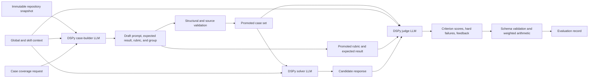

# 017 — Three-LLM DSPy Workspace and Removal of Raw/Legacy Paths

Status: Implemented on 2026-08-20
Priority: P0 / simplifying architectural reset
Supersedes: the raw-program and legacy-compatibility decisions recorded in tasks
001, 009, 012, and 013

## Objective

Make DSPy the only model-program implementation in MS Agent Eval and define
three separate LLM roles: a case-builder LLM authors the evaluation cases, a
solver LLM answers them, and an LLM-as-judge scores the answers. Replace the
current collection of cross-referenced workspace documents with one user-facing
manifest organized around two questions:

1. **Evaluation:** What repository instructions and cases are being evaluated?
2. **Experiments:** How should DSPy run or optimize that evaluation?

The user should need to point to a GitHub repository, select either an entire
skill directory or an explicit list of skill files, point to a cases directory,
and configure an experiment. Snapshot ids, case indexes, compatibility ids,
content hashes, and experiment locks are generated facts rather than authored
inputs.

This is a clean break. Do not retain schema aliases, raw-engine adapters,
deterministic rule judges, evaluator plugin registries, legacy readers, legacy
exporters, deprecated commands, or compatibility shims.

## Product Decisions

- DSPy is a required dependency and the only program runtime.
- There is no user-facing `engine` selector because there is only one engine.
- A DSPy LLM judge is the only component allowed to make semantic correctness
  decisions. Rule-based keyword/checklist evaluators and human-review scoring
  modes are removed.
- Every workspace has three explicit LLM roles:
  - `case_builder` creates prompts, expected results, rubrics, source grounding,
    and leakage-group metadata from the locked repository instructions;
  - `solver` produces the response to each promoted case;
  - `judge` scores the solver response against the case rubric and expected
    result.
- Case building, solving, and judging are separate DSPy programs with separately
  locked prompts, signatures, model identities, parameters, calls, artifacts,
  and budgets.
- The three resolved provider/model identities must be distinct. No role may
  inherit or reuse another role's model in a scored workflow.
- A normal evaluation and a DSPy optimization use the same typed DSPy program.
- Optimization remains a separate experiment that can use only train and
  development cases before publishing a compiled JSON-state artifact.
- Final candidate evaluation uses an untouched test set.
- Text may still be a typed DSPy output, such as `response: str`. Removing the
  raw engine does not prohibit text responses; it removes the parallel
  string-template execution architecture.
- `response_only` remains a valid execution runtime. It describes whether the
  evaluated repository must execute in Docker and is unrelated to the removed
  raw prompt engine.
- Case rubrics, expected results, judge identity, judge calibration, and
  leakage-resistant split governance belong to the evaluation contract. An
  experiment cannot silently redefine correctness or change the judge while
  comparing candidates.
- Deterministic code may validate the judge's structured output and compute
  weighted arithmetic from criterion scores. It must not decide whether the
  candidate semantically satisfied a criterion.
- Generated artifacts remain outside Git under
  `~/ms_agent_eval/<workspace-id>` unless explicitly overridden.

## Why the Current Architecture Must Change

The current UX requires users to coordinate targets, snapshots, suites,
compatibility maps, programs, providers, runtimes, evaluators, optimizers,
storage profiles, and plan matrices by opaque ids. Several of those documents
are reproducibility outputs that should be generated automatically.

The implementation also has two incompatible execution shapes:

- `ExperimentRunner` and `ProgramEngine` are shaped around the raw engine and a
  provider exposing `generate(messages)`;
- `DspyProgramEngine` expects a DSPy LM and does not implement that runner
  protocol.

As a result, the nominally generic runner is not the canonical DSPy execution
path. Keeping the raw engine preserves this split and makes optimization look
like an optional side system rather than the core architecture.

Legacy schema-v0 import/export and historical byte-for-byte Ollama replay add
more public surface without improving new evaluations. Current-schema reporting
remains useful; only the legacy adapters must be removed.

The current deterministic evaluator registry has the same problem. It requires
case-specific Python code, covers only a small part of the MainSequence suite,
and rewards lexical pattern matching rather than actual correctness. It must be
replaced by one rubric-grounded DSPy judge that can assess every properly
authored case.

The rubric remains authored, deterministic input describing what matters. It is
not executable judging code. Semantic decisions come from the judge LLM:



The case builder never receives solver answers, judge outputs, test results, or
optimizer feedback. The solver never receives the rubric, expected response,
judge prompt, or judge outputs.

## Target User Experience

The canonical MainSequence template should be one manifest with two sections.
This example is the target schema, not the current schema:

```yaml
schema_version: 2

workspace:
  id: mainsequence-sdk-evaluation
  # Optional; defaults to ~/ms_agent_eval/mainsequence-sdk-evaluation
  data_root: ~/ms_agent_eval/mainsequence-sdk-evaluation

# ============================================================
# PART A — WHAT IS BEING EVALUATED
# ============================================================

evaluation:
  repository:
    url: https://github.com/mainsequence-sdk/mainsequence-sdk
    ref: v4.4.5

  instructions:
    global:
      - agent_scaffold/AGENTS.md

    # Select exactly one form: directory or files.
    skills:
      directory: agent_scaffold/skills

  case_builder:
    dspy:
      module: Predict
      signature:
        inputs:
          global_context: str
          skill_context: str
          source_context: str
          coverage_request: str
          existing_case_summaries: list[str]
        outputs:
          case_spec: dict[str, object]
          prompt: str
          expected_response: str
          rubric: dict[str, object]
          expected_artifacts: dict[str, str]
          source_paths: list[str]
          leakage_group: str

    model:
      provider: ollama
      name_env: MS_AGENT_EVAL_CASE_BUILDER_MODEL
      endpoint_env: OLLAMA_BASE_URL
      parameters:
        temperature: 0.2

    budget:
      model_calls: 100
      tokens: 500000

    output:
      drafts: external
      promotion: explicit

  cases:
    directory: ./cases

  splits:
    file: ./cases/splits.yaml

  judge:
    dspy:
      module: Predict
      signature:
        inputs:
          task: str
          skill_context: str
          rubric: str
          expected_response: str
          expected_artifacts: str
          candidate_response: str
        outputs:
          criterion_scores: dict[str, float]
          hard_failures: list[str]
          feedback: str

    model:
      provider: ollama
      name_env: MS_AGENT_EVAL_JUDGE_MODEL
      endpoint_env: OLLAMA_BASE_URL
      parameters:
        temperature: 0.0

    calibration:
      directory: ./judge-calibration

    repetitions: 3

# ============================================================
# PART B — HOW DSPY RUNS
# ============================================================

experiments:
  baseline:
    mode: evaluate

    solver:
      dspy:
        module: Predict
        signature:
          inputs:
            global_context: str
            skill_context: str
            task: str
          outputs:
            response: str

      model:
        provider: ollama
        name_env: MS_AGENT_EVAL_SOLVER_MODEL
        endpoint_env: OLLAMA_BASE_URL
        parameters:
          temperature: 0.2

    runtime:
      type: response_only
      python: "3.12"

    repetitions: 1

  optimize-few-shot:
    mode: optimize
    based_on: baseline

    dataset:
      train: train
      development: development
      final_evaluation: test

    optimizer:
      name: LabeledFewShot
      parameters:
        k: 2
        seed: 0

    budget:
      solver:
        model_calls: 100
        tokens: 250000
      judge:
        model_calls: 300
        tokens: 500000
      wall_seconds: 1800

    output:
      compiled_program: content_addressed_json
```

An explicit skill list is the only alternative to directory discovery:

```yaml
evaluation:
  instructions:
    skills:
      files:
        - agent_scaffold/skills/project_builder/SKILL.md
        - agent_scaffold/skills/data_publishing/data_nodes/SKILL.md
        - agent_scaffold/skills/platform_operations/orchestration_and_releases/SKILL.md
```

The schema must reject `directory` and `files` when both or neither are set.
There is no user-authored `exact_count`, required-id assertion, filename
locator, logical-id prefix, or source assertion block.

## Discovery and Generated Identity

### Repository and instructions

The framework resolves the authored tag or commit to a full commit, acquires an
immutable external snapshot, and records every selected file's repository path,
normalized path, size, and hash.

`skills.directory` means:

- recursively discover files named `SKILL.md` below that directory;
- derive the skill id from the parent path relative to the directory;
- fail when the directory is missing, escapes the snapshot, contains unsafe
  links, produces duplicate ids, or discovers zero skills;
- record the discovered count and exact file list in the generated lock.

`skills.files` means:

- use exactly the listed repository-relative files;
- preserve the authored order for diagnostics but use canonical ordering for
  identity hashing;
- fail on missing, duplicate, unsafe, or non-`SKILL.md` entries.

The count and hashes are lock evidence. They are never user assertions.

### Cases

`cases.directory` recursively discovers `case.yaml`. Each case declares the
skill it exercises and references its local prompt, expected response/artifacts,
and rubric. The framework generates the suite index rather than requiring the
user to duplicate every case path in a manifest.

Minimum case metadata:

```yaml
schema_version: 2
id: or-001-recurring-artifact-job
title: Design a reproducible recurring Artifact job
skill: platform_operations/orchestration_and_releases
group: recurring-job-design
prompt: prompt.md
expected: expected/response.md
rubric: rubric.yaml
```

Validation must prove that every case skill resolves to a discovered skill,
every case belongs to exactly one split group, every referenced file exists,
every case has a rubric and expected result, and the configured LLM judge passes
calibration before it scores any candidate response.

### Internal artifacts

The loader/compiler generates, but the user does not author:

- resolved commit and source snapshot lock;
- discovered global-context and skill catalog;
- case-suite index and content hash;
- split manifest and leakage-group validation;
- source/case compatibility mapping;
- normalized case-builder DSPy program, model, generation request, and draft
  manifest identity;
- normalized solver DSPy program and model identity;
- normalized judge DSPy program, judge model, and calibration identity;
- immutable experiment lock;
- compiled DSPy state manifest for optimization.

These may be inspectable JSON artifacts under the external data root, but they
must not become additional required configuration files.

## Command Experience

The minimum flow should be:

```bash
ms-agent-eval init \
  --id mainsequence-sdk-evaluation \
  --repo https://github.com/mainsequence-sdk/mainsequence-sdk \
  --ref v4.4.5 \
  --global-instructions agent_scaffold/AGENTS.md \
  --skills-directory agent_scaffold/skills \
  --cases ./cases

export MS_AGENT_EVAL_SOLVER_MODEL=solver-model-name
export MS_AGENT_EVAL_JUDGE_MODEL=judge-model-name
export MS_AGENT_EVAL_CASE_BUILDER_MODEL=case-builder-model-name

ms-agent-eval validate
ms-agent-eval cases build --coverage "Create cases for every discovered skill"
ms-agent-eval cases inspect-drafts
ms-agent-eval cases promote
ms-agent-eval inspect
ms-agent-eval run baseline
ms-agent-eval run optimize-few-shot
```

`inspect` must show the resolved commit, selected global instructions,
discovered skills, discovered cases, split counts, rubric/expected-answer
coverage, case-builder DSPy signature/model and draft status, solver DSPy
signature/model, judge DSPy signature/model, calibration status, runtime, and
projected experiment count before any model request.

`run` performs resolution automatically when the requested immutable source is
not already present externally. It must print the generated lock id and external
result location.

## Case-Builder LLM Refactor

Case creation is a first-class DSPy workflow, not a manual prerequisite hidden
outside the framework:

1. Add a typed `CaseBuilder` DSPy signature. It receives the immutable global
   instructions, one selected skill, a coverage request, source material from
   the same locked snapshot, and summaries of existing cases.
2. It returns a complete case package: metadata, self-contained prompt,
   expected response, optional expected artifacts, rubric with hard failures and
   weighted criteria, immutable source paths, and a leakage-resistant group id.
3. The builder may read repository instructions and supporting source files. It
   must never receive solver responses, judge results, optimizer traces, held-out
   scores, or test-set feedback.
4. Write every builder request, response, parsed package, validation result, and
   source identity beneath the external data root as a draft. A model call must
   never silently modify the committed case set.
5. Validate draft structure, referenced snapshot paths, unique ids, skill
   resolution, required files, rubric weights, expected artifacts, and prompt
   separation before promotion.
6. The builder proposes a leakage group but does not choose train,
   development, or test. Group-to-split assignment happens afterward through a
   locked split policy so the builder cannot intentionally author to a split.
7. Promotion is an explicit operation that copies a validated draft package
   into the configured cases directory and records builder model identity,
   DSPy-program hash, source snapshot, generation-request hash, and draft content
   hash as case provenance.
8. New schema-v2 cases require case-builder provenance. A user may accept or
   reject a draft, but direct untracked edits invalidate provenance and require
   rebuilding or an explicit new revision.
9. Promoted cases become normal version-controlled evaluation inputs. The model
   request/response and rejected drafts remain external and are never committed.
10. Case-builder calls, tokens, costs, failures, and artifacts have their own
    budget and report section, separate from solver and judge usage.

The case builder may perform multiple DSPy passes—for example draft, critique,
and revision—but they all use the locked `case_builder` role. This does not
introduce a fourth LLM role.

## DSPy-Only Runtime Refactor

Replace the generic multi-engine abstraction with one coherent DSPy path:

1. Make `dspy==3.2.1` a required project dependency and remove the `dspy` and
   `all` extras.
2. Replace `ProgramSpecification.engine + payload` with a typed
   `DspyProgramSpecification`. No engine discriminator remains.
3. Replace `ProgramEngine` with a DSPy-specific execution contract accepting a
   DSPy module, DSPy LM, adapter, typed inputs, observer, and optional compiled
   state artifact.
4. Refactor `ExperimentRunner` to execute that contract directly. The runner,
   baseline evaluation, and optimizer must share the same program construction
   and LM-binding path.
5. Change provider bindings to construct an observed `dspy.LM`. Remove the
   separate raw `generate(messages)` provider protocol and direct raw-call
   observation path.
6. Retain final rendered request/response, usage, latency, provider/model
   identity, and configured cost evidence through `ObservedDspyLM`.
7. Keep state artifacts JSON-only with `save_program=False`, pickle prohibited,
   and unsafe LM state loading disabled.
8. Make evaluation preflight run before program construction or model calls.
9. Keep benchmark execution and optimization as separate run kinds sharing the
   same immutable evaluation contract.

## LLM-as-Judge Refactor

Replace the deterministic evaluator callback registry with a first-class DSPy
judge program:

1. Add a typed `RubricJudge` DSPy signature. Its inputs are the task, immutable
   skill context, rubric, expected response/artifacts, and candidate response.
   Its outputs are criterion-level scores, hard failures, and actionable
   feedback.
2. Run the judge through the same observed DSPy LM infrastructure as solver
   generation. Persist every rendered judge request, response, parse result,
   usage record, latency, and model identity externally.
3. Lock the judge signature, instructions, module type, adapter, model,
   parameters, calibration corpus, and repetition policy into the experiment
   identity.
4. Resolve case-builder, solver, and judge provider/model identities
   independently. Any equality between their resolved identities is a preflight
   error for a scored workflow.
5. Never send the expected response or rubric to the solver program. They
   are judge-only inputs.
6. Validate that the judge returns exactly the rubric's criterion ids and scores
   within the declared range. Framework code may reject malformed output and
   calculate the rubric's weighted total; it may not infer semantic criterion
   satisfaction itself.
7. Treat judge parse failures, missing criteria, contradictory hard-failure
   output, or incomplete calls as evaluation failures—not zero-scored model
   answers.
8. Use repeated judge calls when configured and retain every vote. Aggregation
   policy is deterministic bookkeeping over LLM judgments, not a deterministic
   semantic judge.
9. Require a calibration corpus containing human-labelled strong, partial,
   incorrect, contradictory, and adversarial candidate responses. Calibration
   measures agreement and ranking quality; it must not be a keyword fixture
   checklist.
10. Keep the judge fixed during solver optimization. Optimizer feedback may
   use judge results only for train/development cases. Test judge outputs remain
   sealed until the compiled candidate artifact is published.
11. Track solver-model calls and judge-model calls separately in budgets and
    reports so optimization cost cannot hide judge cost.

The case builder, solver, and judge always produce separate calls and evidence.
No role-reuse escape hatch exists for a scored or promotion workflow.

## Required Deletions

Delete the following behavior rather than deprecating it:

- `src/ms_agent_eval/programs/raw/`;
- raw engine branches and the `engine: raw` schema value;
- raw system/user string-template program configuration;
- `experiments/mainsequence-sdk/programs/raw-legacy-mainsequence.yaml`;
- `tests/fixtures/workspace/programs/raw-control.yaml`;
- raw engine and historical raw-request parity tests;
- direct Ollama raw-program request APIs that are unused by the DSPy LM binding;
- `src/ms_agent_eval/core/evaluator_plugins.py` and dynamic deterministic
  evaluator-module loading;
- rule-based evaluator registries, callbacks, keyword/checklist judges, and
  `rule-based-checklist` case metadata;
- `manual_review_required` and `not_evaluable` scoring modes as alternate judge
  implementations;
- `experiments/mainsequence-sdk/evaluators/mainsequence/plugin.py` and its
  deterministic calibration fixtures;
- `ms-agent-eval evaluator validate` and `ms-agent-eval evaluator score`; replace
  their useful validation behavior with workspace validation and LLM-judge
  calibration;
- deterministic evaluator tests and the offline ideal-response scoring workflow;
- `src/ms_agent_eval/core/legacy.py`;
- `ms-agent-eval legacy ...` CLI commands;
- schema-v0 legacy run readers and unresolved-legacy report adaptation;
- `tests/fixtures/legacy-run-v0/` and legacy reporting tests;
- current documentation that presents raw versus DSPy as supported choices.

Keep generic current-schema reporting, case/rubric loading, structured
evaluation records, and content-addressed artifact storage. Refactor them to
record LLM-judge identity and evidence rather than deterministic evaluator
method/version fields.
Do not remove domain language such as “raw SQL” or “raw file” from evaluation
cases; those terms are unrelated to the removed raw program engine.

Update `.agents/skills/case-authoring/SKILL.md` as part of this task. Its current
requirement for `rule-based-checklist`, `human-review`, and `none` evaluator
status/method pairs is superseded. Authored cases must instead provide complete
rubrics and expected results consumable by the workspace's locked LLM judge.
The skill must invoke the configured case-builder workflow, validate external
drafts, and explicitly promote accepted case packages instead of directly
inventing case files without builder provenance.

Historical numbered task records may remain as an audit trail only when marked
“Superseded by task 017.” They must not appear in current getting-started or
architecture guidance. Remove the DSPy feasibility report from current
navigation because its recommendation to retain raw replay is no longer the
architecture decision.

## MainSequence Template Migration

Convert the existing MainSequence workspace into the schema above:

- repository URL: `https://github.com/mainsequence-sdk/mainsequence-sdk`;
- ref: `v4.4.5`, resolved immutably at runtime;
- global instructions: `agent_scaffold/AGENTS.md`;
- skills: the complete `agent_scaffold/skills` directory;
- case builder: a separately configured DSPy model grounded in the immutable
  MainSequence snapshot and selected skill;
- cases: promoted builder outputs under the configured MainSequence cases
  directory;
- judge: a workspace-owned DSPy rubric judge and human-labelled calibration
  corpus;
- baseline: typed `InstructionResponse` through `dspy.Predict`;
- optimization: `LabeledFewShot`, train/development only, untouched test final;
- default data root: `~/ms_agent_eval/mainsequence-sdk-evaluation`.

Remove the current per-case evaluator statuses and the single rule-based
MainSequence implementation. Every selected case must instead have a complete
rubric and expected result that the common LLM judge can consume. `inspect` and
`validate` must report missing rubric/expected-answer coverage and judge
calibration status. A scored run fails before solver calls when either gate
is incomplete.

Remove the pre-task-017 MainSequence cases instead of carrying them as a hidden
fallback. A configured deployment may use their historical coverage themes as
builder coverage requests, but only actual outputs of the new observed builder
workflow may be promoted. The repository template therefore begins with an
empty case bank rather than relabelling old files or inventing third-LLM
provenance.

## Implementation Sequence

1. Add schema-v2 models and strict validation for the two-section manifest.
2. Implement repository, skill, and case discovery plus generated identities.
3. Implement the typed observed DSPy case builder, external draft store,
   validation, provenance, and explicit promotion workflow.
4. Implement the manifest compiler that produces immutable internal locks.
5. Refactor provider binding, observation, runner, and lifecycle around DSPy.
6. Implement the typed observed DSPy LLM judge, calibration gate, voting, and
   criterion validation.
7. Route evaluation and optimization through the same solver-program factory
   and the same fixed judge-program factory.
8. Convert the MainSequence example and synthetic test workspace to schema v2.
9. Delete raw, deterministic-evaluator, and legacy modules, fixtures, CLI
   commands, configurations, and tests in one change; add no aliases.
10. Replace the current documentation and case-authoring instructions with the
    three-LLM builder/solver/judge workflow.
11. Remove now-empty registries/directories and regenerate the lockfile and wheel.

## Acceptance Criteria

- A new user can define MainSequence using only repository URL/ref, global
  instruction path, skills directory, case-builder model, cases directory,
  judge model, solver model, and experiment settings.
- An explicit `skills.files` list works as the sole alternative to
  `skills.directory`.
- Both-or-neither skill selection fails with a precise validation error.
- No user-authored count assertions or duplicated case index are required.
- The installed library always includes DSPy and exposes no engine selector.
- No raw program package, deterministic semantic evaluator, evaluator plugin
  registry, raw program configuration, raw engine test, legacy CLI, legacy
  reader/exporter, or legacy runtime fixture remains.
- A fixed-response case-builder LM, solver LM, and judge LM exercise the full
  production DSPy authoring and evaluation lifecycle in tests; production
  scoring has no rule/checklist judge path.
- The case-builder LLM produces a complete externally stored draft case package
  grounded in immutable source paths, and only explicit promotion writes it to
  the authored cases directory.
- Every promoted schema-v2 case records the case-builder program, model, source
  snapshot, generation request, and content hashes.
- Every production semantic score originates from an observed DSPy LLM judge
  call with a locked signature, prompt, model, parameters, and calibration hash.
- Case-builder, solver, and judge provider/model identities are resolved
  independently and must all differ; accidental role reuse fails preflight.
- Judge output must cover every rubric criterion exactly; deterministic code is
  limited to validation, weighted arithmetic, and vote aggregation.
- Case-builder, solver, and judge calls, tokens, costs, failures, and artifacts
  are reported separately.
- DSPy optimization can access train/development only, publishes state-only
  JSON, and evaluates the candidate on an untouched test split.
- Missing rubric/expected-result coverage or failed judge calibration stops the
  run before any solver model call.
- `inspect` reports all resolved source, skill, case, split, case-builder DSPy,
  solver DSPy, judge DSPy, model, calibration, and runtime identities before
  execution.
- Runtime outputs are written only under the external data root.
- Python 3.12+, Ruff, the complete test suite, lock verification, wheel build,
  and clean-install CLI smoke test pass.

## Verification Commands

```bash
uv sync --python 3.12
uv run ms-agent-eval validate --workspace experiments/mainsequence-sdk/workspace.yaml
uv run ms-agent-eval inspect --workspace experiments/mainsequence-sdk/workspace.yaml
uv run ms-agent-eval run baseline --workspace experiments/mainsequence-sdk/workspace.yaml
uv run ruff check src tests
uv run pytest
uv lock --check
uv build
```

Repository inspection must additionally confirm that no removed public surface
remains:

```bash
rg -n "programs\.raw|engine: raw|RawMessageEngine|legacy export|read_legacy_run" \
  src tests experiments README.md docs
```

The same inspection must find no active deterministic-judge surface:

```bash
rg -n "EvaluatorRegistry|rule-based-checklist|evaluator score|evaluator_plugins" \
  src tests experiments README.md docs
```

Matches inside this task or historical superseded task records are acceptable;
matches in active source, tests, templates, or current guidance are not.
